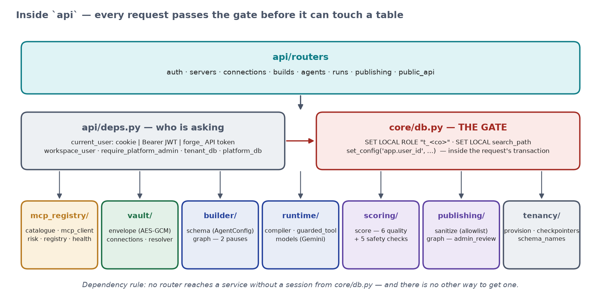
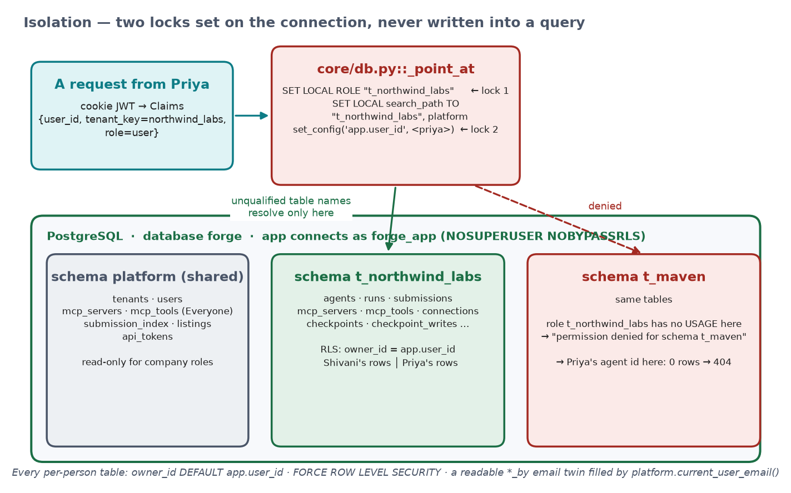

<div align="center">

# Forge

**The thing that builds agents.**

A multi-tenant platform where a person describes an agent in plain English, the platform builds it
from real MCP tool servers, pauses for a human before anything risky, scores it, and — after an
admin's review — lets another company install it with their own credentials.

*Agent Platform Capstone · Data Sense · September 2026*

[Brief](https://fnusatvik07.github.io/agent-platform-capstone/brief.html) ·
[Architecture](docs/ARCHITECTURE.md) ·
[HLD / LLD](docs/DESIGN.md) ·
[Design document](docs/DESIGN-DOCUMENT.md) ·
[Backend code walkthrough](docs/BACKEND.md) ·
[Verify in the database](docs/VERIFY.md) ·
[Editable diagrams (.drawio)](docs/architecture.drawio) ·
[Technical report (.docx)](docs/Forge-Complete-Technical-Report.docx)

</div>

---

## Start it

```bash
git clone https://github.com/Shivanilarokar/AgentPlatformCapstone.git && cd AgentPlatformCapstone
cp .env.example .env              # put your free Gemini key in GOOGLE_API_KEY (https://aistudio.google.com/apikey)
docker compose up -d --build      # db · api · frontend · pgadmin — nothing else to install
```

Open <http://localhost:5173>. No paid accounts are needed anywhere.

## Log in

| Who | Email | Password | What they can do |
|---|---|---|---|
| Platform admin | `admin@forge.dev` | `Passw0rd!` | share servers with everyone, review the marketplace (created at startup from `.env`) |
| Company admin | `shivani@northwind.example` | `Passw0rd!` | everything a user can + share a server with the whole company |
| User | `priya@northwind.example` | `Passw0rd!` | register servers, connect, build, test, publish, install |
| Another company | `jai@maven.example` / `riya@maven.example` | `Passw0rd!` | for step 6 — the marketplace install |

Or sign up: **Create a new company** makes you its admin; **Join an existing company** (exact name)
makes you a user. On a fresh database only `admin@forge.dev` exists — sign the others up in the UI.

---

## What it does — the six steps


| # | Step | What the platform does |
|---|---|---|
| 1 | **Register a tool server** | Connects to a real MCP server, calls `tools/list`, stores exactly what came back, marks each tool `read` / `write` / `destructive`. Nobody types a tool name. |
| 2 | **Connect to it** | Your token is AES-256-GCM encrypted the moment you paste it. Nothing readable is stored; no endpoint can return it. |
| 3 | **Describe an agent** | *"Read my open GitHub issues every morning and post a summary to Slack."* → a design from **your** registry, **pause 1** (pick tools), **pause 2** (missing credential), then a JSON document — never generated code. |
| 4 | **Test it** | A live Playground. A write tool stops the run and shows **Approve / Reject** in the chat. Thumbs feed a score. |
| 5 | **Publish it** | Blocked below the score gate. Above it, an allow-listed, scrubbed listing goes to the **platform admin**, who approves or sends it back — days later, across restarts. |
| 6 | **Someone else installs it** | A different company gets its own copy in its own schema and is asked for **its own** credentials. The original is untouched. |

The one idea everything hangs off: **an agent is a configuration document, not code**
(`backend/app/builder/schema.py::AgentConfig`). The builder writes it; one runtime
(`runtime/compiler.py::compile_agent`) reads it. Every pause — build, tool approval, admin review —
is a LangGraph `interrupt()` persisted in Postgres, so it survives `docker compose restart api`.

---

## Architecture


Four containers from one `docker compose up`. Inside `api`, every request passes **the gate**
before it can touch a table:



**Isolation — two locks, set on the connection, never written into a query.** Every company is a
Postgres schema *and* a Postgres role; every request runs `SET LOCAL ROLE "t_<company>"`,
`SET LOCAL search_path`, and `set_config('app.user_id', …)`. Row-level security then keeps each
person's rows their own. Handlers write `select(Agent)` with no `WHERE` — there is no filter to
delete.



The data model, as built:


More: [`docs/ARCHITECTURE.md`](docs/ARCHITECTURE.md) (plain language),
[`docs/DESIGN.md`](docs/DESIGN.md) (sequence diagrams, ER, algorithms, API contract),
[`docs/BACKEND.md`](docs/BACKEND.md) (the code, function by function, with flowcharts).

---

## Running it — the details

Prerequisites: **Docker Desktop**; **uv** (<https://docs.astral.sh/uv/>) only for running the
tests on the host (`uv sync --extra dev`); Node only if you want to build the UI outside Docker.

| URL | What | Sign in |
|---|---|---|
| <http://localhost:5173> | the product | see the accounts below |
| <http://localhost:8000/docs> | FastAPI Swagger | the browser cookie, or a `forge_` API token |
| <http://localhost:5050> | pgAdmin — the database in a browser | `admin@forge.dev` / `admin`; server `forge` is pre-registered |
| <http://localhost:8000/health> | `{"ok": true}` | — |

`backend/app` and `Frontend/` are bind-mounted: edit locally, the containers reload. Rebuild
(`--build`) only when `pyproject.toml`, `Dockerfile` or `Frontend/package.json` change.

The platform admin's email and password come from `.env` (`PLATFORM_ADMIN_EMAIL` /
`PLATFORM_ADMIN_PASSWORD`); change them there before the first start.

### Walk the six steps (≈ 10 minutes)

1. **Registry** — click the `filesystem` chip → *Connect & save*: 14 tools appear with risk badges,
   straight from the server. Click `github` → paste a PAT → save: 45 tools, and the PAT is now your
   encrypted connection. For a demo that behaves the same for every account, do this as
   `admin@forge.dev` with visibility *Everyone* (the token is used once for discovery, not stored).
2. **Connections** — add `slack` with a user OAuth token (`xoxp-…`). The list shows dots, never the value.
3. **Build** — type *I want an agent that reads my open GitHub issues every morning and posts a
   summary to Slack.* → pause 1 (coordinator + collector + poster) → `docker compose restart api`,
   reload, same card → *Use these 2* → pause 2 if Slack is missing → *Built and deployed*.
4. **My Agents → Playground** — *Summarise the open issues in `<owner>/<repo>` and post 3 lines to
   Slack channel `C0…`* → watch the collector read, the poster reach the write tool, the
   **Approve / Reject** card. Restart the API again; the card is still there. 👍 the run.
5. **Settings → Publish** — see exactly what leaves → Publish → sign in as `admin@forge.dev` →
   **Admin Review** → Approve with a note.
6. Sign in as `riya@maven.example` → **Marketplace** → *Add to my workspace* → the Playground asks
   for *her* GitHub and Slack. Paste the original agent's URL as Riya → 404.

What each click writes to the database, with the pgAdmin queries: [`docs/VERIFY.md`](docs/VERIFY.md).

### Credentials for the remote servers

| Server | Endpoint | Token |
|---|---|---|
| GitHub | `https://api.githubcopilot.com/mcp/` | a personal access token — <https://github.com/settings/personal-access-tokens/new> (Issues, Pull requests, Contents) |
| Slack | `https://mcp.slack.com/mcp` | a **user** OAuth token `xoxp-…` from <https://api.slack.com/apps> → OAuth & Permissions → User Token Scopes (`chat:write`, `channels:read`, `channels:history`, `search:read`, …) → Install. Bot tokens (`xoxb-`) are rejected. Posting needs a channel **ID** (`C0…`) the app is a member of. |
| Jira | `https://mcp.atlassian.com/v2/mcp` | a scoped API token — <https://id.atlassian.com/manage-profile/security/api-tokens>; your org admin must enable API-token auth for the Rovo MCP server |

`filesystem`, `git` and `sqlite` are the reference servers, launched over stdio inside the `api`
container against `/srv/workspace` and `/srv/var`. No token.

### Tests

```bash
uv run pytest backend/tests        # needs docker compose up (Postgres); ~2 min
# 172 passed, 1 skipped  (the skip is the opt-in live-model test: LIVE_MODEL=1)
```

`backend/tests/graded/` has one file per graded check — isolation (with the app filter removed),
credentials, sanitize, overnight review, multi-agent runtime with approval, Postman, install — run
against a real Postgres with two throwaway companies.

### Reset

There is no Alembic yet. After a change to `backend/app/models/*.py`:

```bash
docker compose down -v && docker compose up -d --build   # all data gone; sign up again
```

---

## Tech stack — and why this one

| Layer | Choice | Why |
|---|---|---|
| API | **FastAPI** + Uvicorn | async-native for LangGraph and the MCP SDK; Pydantic validates the agent document itself |
| Database | **PostgreSQL 16** | the only engine that gives schemas + roles + row-level security + JSONB + the official LangGraph checkpointer at once |
| ORM / driver | **SQLAlchemy 2 async** + **psycopg 3** | one driver serves SQLAlchemy *and* `langgraph-checkpoint-postgres`; `SET LOCAL` scoped by `session.begin()` |
| Agent runtime | **LangGraph 1.x** + `AsyncPostgresSaver` | `interrupt()` + a durable checkpointer *is* "the build survives a restart" and "the approval waits three days" |
| Model | **Gemini** via `langchain.init_chat_model` (`gemini-flash-lite-latest`, with a fallback chain of Gemini models) | free tier; a rate limit mid-demo falls through to the next model with the same tools bound |
| Tools | **MCP Python SDK** | `initialize` · `tools/list` · `tools/call` over stdio / streamable HTTP / SSE — the registry asks the server, never a human |
| Crypto | **`cryptography`** AES-256-GCM envelope | AAD `company:user:server` binds a ciphertext to its owner; the plaintext exists in one function |
| Auth | **PyJWT** + **argon2** | the JWT carries `tenant_key`, `user_id`, `role`, so the gate needs no lookup to pick a schema; `forge_` API tokens for Postman |
| Frontend | **React 18** + **Vite**, no UI framework | SSE streaming in the Playground; screens follow the brief's mockups |
| Packaging | **Docker Compose** | `docker compose up` is a submission requirement; stdio MCP servers run inside the `api` image |

Deliberately not used: LangGraph Platform (not free), Redis/Celery (one asyncio task is enough for
the health sweep), a cloud KMS (env master key + version column), code generation (Rule 1).

---

## Folder structure

```
.
├── backend/
│   ├── app/
│   │   ├── server.py            FastAPI app + lifespan (bootstrap, platform admin, health sweep)
│   │   ├── core/                config (.env) · security (Claims, JWT, API tokens) · db (THE GATE)
│   │   ├── api/
│   │   │   ├── deps.py          who is asking → Claims; which session a route gets
│   │   │   └── routers/         auth · servers · connections · builds · agents · runs · publishing · public_api
│   │   ├── tenancy/             schema_names · provision (schema, RLS, role per company) · checkpointers
│   │   ├── models/              platform_.py (shared tables) · tenant.py (per-company tables)
│   │   ├── mcp_registry/        catalogue · mcp_client (the protocol) · risk · registry · health
│   │   ├── vault/               envelope (AES-GCM) · connections (add / use / revoke) · resolver
│   │   ├── builder/             schema (AgentConfig) · graph (understand → ⏸ → ⏸ → assemble → persist)
│   │   ├── runtime/             compiler (config → graph) · guarded_tool (the approval gate) · models
│   │   ├── scoring/             score (six quality checks, five safety booleans)
│   │   └── publishing/          sanitize (allowlist projection) · graph (sanitize → ⏸ admin_review → decide)
│   └── tests/                   conftest (two throwaway companies) · graded/ (one file per check) · unit tests
├── Frontend/
│   └── src/                     api.js · App.jsx · Shell.jsx · ui.jsx · pages/ (SignIn, Registry, Connections,
│                                Build, MyAgents, AgentDetail + Playground/ApiTab/Settings, AdminReview, Marketplace)
├── docker/db/init.sql           creates the non-superuser app role forge_app
├── docs/                        DESIGN-DOCUMENT (the 2-page submission) · ARCHITECTURE (+ UML) · DESIGN (HLD/LLD) · BACKEND · VERIFY · architecture.drawio · report .docx · img/
├── docker-compose.yml           db · api · frontend · pgadmin
├── Dockerfile                   the api image (Python 3.11, uv, Node for the stdio MCP servers)
├── pyproject.toml · uv.lock     Python dependencies
└── .env.example                 the keys the app reads
```

---

## What we would do differently with another month

**1. Deploy it to the cloud.** The same `api` image on a container service (Azure Container Apps /
AWS ECS / Fly.io) with a managed PostgreSQL 16 — `docker/db/init.sql` creates the non-superuser
`forge_app` role there too — the frontend built with `vite build` and served behind HTTPS, and the
secrets (`GOOGLE_API_KEY`, `JWT_SECRET`, `FORGE_MASTER_KEY`) in the provider's secret store instead
of `.env`. Nothing in the isolation design changes: it is Postgres roles and row-level security, not
infrastructure, and LangGraph checkpoints already live in Postgres, so a replica restart loses nothing.

**2. Migrations** — Alembic with two trees (platform, tenant template) instead of `docker compose down -v`.
**3. Joining a company by invite link** instead of by name. **4. A larger model** behind the same
`ModelSpec`. The full list, with what we would *not* change, is in
[`docs/DESIGN-DOCUMENT.md`](docs/DESIGN-DOCUMENT.md).

---

## What is submitted

| Deliverable | Where |
|---|---|
| The platform — `docker compose up` and it runs; how to start it and log in | this repository, this README |
| The design document — how each rule was made true, what we would do with another month | [`docs/DESIGN-DOCUMENT.md`](docs/DESIGN-DOCUMENT.md) |
| The multi-agent demo agent, built through the platform | *GitHub Issue Daily Summary*: coordinator → `collector` (GitHub) → `poster` (Slack, asks first); built from the brief's sentence in Build, published, approved, installed by a second company |

## Status

All six steps of the brief and all nine graded checks are implemented and tested. Known gaps,
on purpose for the capstone: no Alembic (reset with `down -v`); joining a company needs only its
name (the production answer is an admin invite link). Details in
[`docs/DESIGN.md` §15](docs/DESIGN.md).
