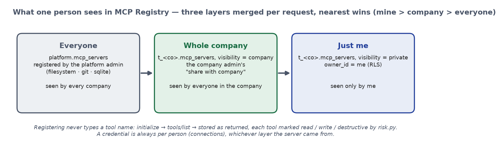
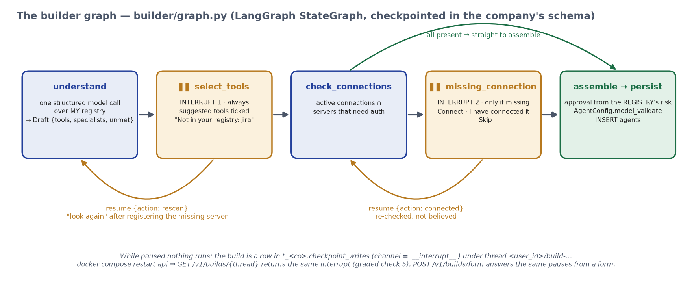
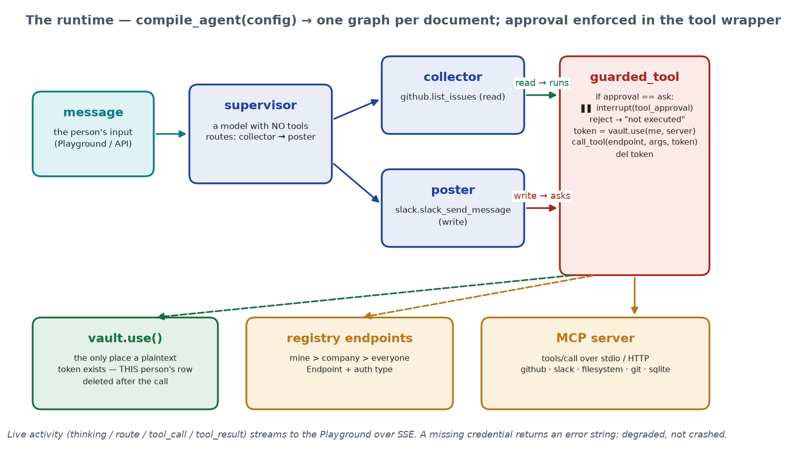
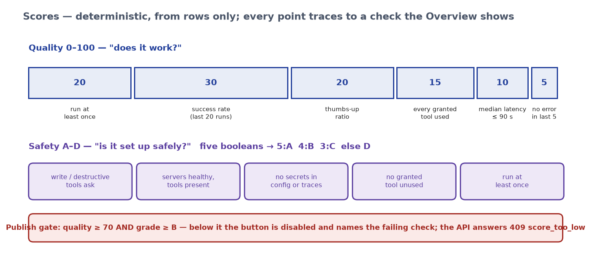
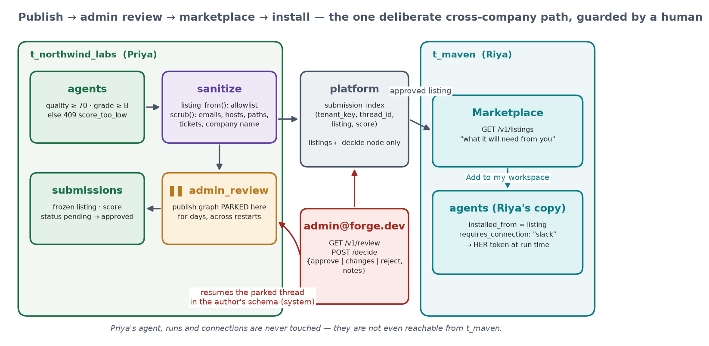
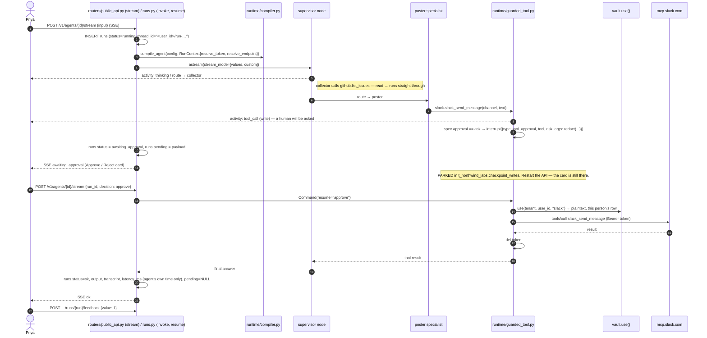
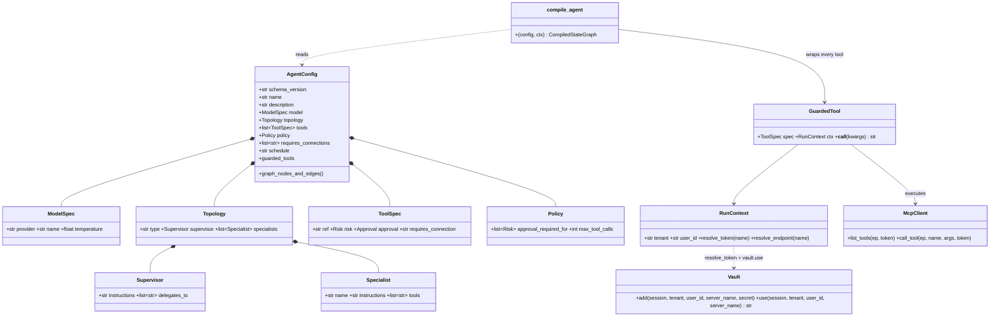
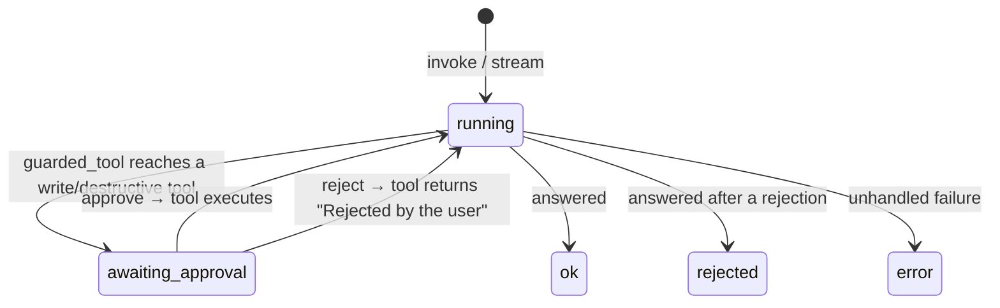

# Architecture — as built

Forge, the Agent Platform Capstone. This is the plain-language version of the system that is
actually running in the repo today. `docs/DESIGN.md` carries the technical HLD/LLD (diagrams,
data model, API contract, algorithms); `docs/VERIFY.md` says how to see each claim in the
database; `docs/BACKEND.md` walks the code; `README.md` is how to run it. The block diagrams are
in `docs/img/` (PNG) and, editable, in `docs/architecture.drawio` (7 pages: containers, inside the
API, isolation, builder graph, runtime, publish/review/install, data model).

---

## 1. What it is, in one paragraph

A person signs in, types *"I want an agent that reads my open GitHub issues every morning and
posts a summary to Slack"*, and the platform builds that agent from the tool servers in their
registry, deploys it, and gives them a chat window to test it in. A risky action (posting to
Slack) stops and asks them first. When they are happy they publish; the platform admin reviews;
once approved, someone in a **different company** installs it into their own workspace **with
their own credentials**. We did not build an agent. We built the thing that builds agents.

---

## 2. The one idea everything hangs off

> **An agent is a configuration document, not generated code.**

The builder writes a JSON document (`AgentConfig`, `backend/app/builder/schema.py`). One runtime
(`backend/app/runtime/compiler.py::compile_agent`) reads it and assembles a LangGraph graph from
it. No Python is ever generated. That single decision is why:

- **we** decide where a run stops for approval — the agent has no say (Rule 4);
- the document can be validated, scored, sanitized and copied to another company (Rule 5/6);
- the graph picture on the agent page is *drawn from* the document, so it cannot go stale.

### The document, as the builder writes it today

```jsonc
{
  "schema_version": "1.0",
  "name": "GitHub Issue Daily Summary",
  "description": "Reads open GitHub issues every morning and posts a summary to Slack.",
  "model": { "provider": "google_genai", "name": "gemini-flash-lite-latest", "temperature": 0 },
  "topology": {
    "type": "supervisor",                       // "single" | "supervisor"
    "supervisor": { "instructions": "Send the work to the collector first, then hand what it found to the poster.",
                    "delegates_to": ["collector", "poster"] },
    "specialists": [
      { "name": "collector", "instructions": "Gather the open issues and hand back a clear summary.", "tools": ["github.list_issues"] },
      { "name": "poster",    "instructions": "Post what the collector found, exactly once.",           "tools": ["slack.slack_send_message"] }
    ]
  },
  "tools": [
    { "ref": "github.list_issues",       "risk": "read",  "approval": "auto", "requires_connection": "github" },
    { "ref": "slack.slack_send_message", "risk": "write", "approval": "ask",  "requires_connection": "slack" }
  ],
  "policy": { "approval_required_for": ["write", "destructive"], "max_tool_calls": 25 },
  "requires_connections": ["github", "slack"],
  "schedule": null
}
```

**Three invariants, enforced by the Pydantic model itself:**

- **(a)** `requires_connection` names a server *kind* (`"slack"`), never a connection id and never a
  token. The config says *what it needs*, not *whose*. At run time the runtime resolves
  `server name + whoever is running it → their own connection row`. That is why a marketplace can
  exist at all.
- **(b)** `approval` is never trusted. A write/destructive tool with `approval: auto` is rejected by
  the validator, and `assemble()` in the builder recomputes it from the **registry's** risk marking
  anyway. Graded check 3.
- **(c)** A token-shaped string cannot even enter the document (`SECRET_SHAPES` validator). The config
  is the only thing that ever travels to another company.

---

## 3. The boxes


Four containers from one `docker compose up`:

| Container | What it is | Port |
|---|---|---|
| `db` | PostgreSQL 16 — the only state: every schema, every LangGraph checkpoint | 5432 |
| `api` | FastAPI + Uvicorn; the builder graph, the runtime, the registry client, the vault; launches stdio MCP servers as subprocesses | 8000 |
| `frontend` | React 18 + Vite dev server; proxies `/auth` and `/v1` to the API | 5173 |
| `pgadmin` | a browser for the database, for humans | 5050 |

Inside `api`, the pieces:


```
Browser (React SPA)
   │  httpOnly cookie with a JWT { user_id, tenant_id, tenant_key, email, role }
   ▼
FastAPI routers  ──►  the tenant gate  (core/db.py::_point_at — SET LOCAL ROLE + search_path + app.user_id)
   │
   ├── mcp_registry/   catalogue · mcp_client (initialize, tools/list, tools/call) · risk · registry · health
   ├── vault/          envelope (AES-256-GCM) · connections (add / use) · resolver
   ├── builder/        schema (AgentConfig) · graph (the two pauses)
   ├── runtime/        compiler (config → LangGraph) · guarded_tool (the approval gate) · models (Gemini)
   ├── scoring/        score (six quality checks, five safety booleans)
   └── publishing/     sanitize (allowlist projection + scrub) · graph (admin_review pause)
                             │
                          Postgres:  platform schema + one schema per company (t_<key>)
```

Only two of these are real programs: the **builder graph** and the **runtime compiler**. The rest is
a protocol client, forty lines of cryptography, and CRUD over a database.

---

## 4. People, companies, roles

| Role | How you get it | What it can do |
|---|---|---|
| `platform_admin` | created at startup from config (`PLATFORM_ADMIN_EMAIL/PASSWORD`, default `admin@forge.dev`); exactly one; cannot be created by sign-up | share servers with **everyone**; review marketplace submissions. Has no company and no workspace — Build / My Agents / Connections answer 404 |
| `admin` | sign-up with **Create a new company** — the first person *is* the admin | everything a user can, plus **share a server with the whole company** (and take it back) |
| `user` | sign-up with **Join an existing company** (the name must match) | register servers for themselves, connect credentials, build, test, publish, install |

"Company", "workspace" and "tenant" are the same thing: one Postgres schema. Inside a company every
person works alone by default (next section); the admin's only extra power is sharing a server.

Known gap, on purpose for the capstone: joining needs only the company name. The production answer
is an invite link from the admin; nothing in the isolation below depends on it.

---

## 5. Isolation — two locks, set on the connection, never written into a query


The brief: *"we delete your application-level check and try again."* So there is no
application-level check. Every request that touches company data passes through one function,
`core/db.py::_point_at`, which runs three statements inside the request's transaction:

```sql
SET LOCAL ROLE "t_northwind_labs";                          -- lock 1: the company
SET LOCAL search_path TO "t_northwind_labs", platform;
SELECT set_config('app.user_id', '<uuid of the person>', true);  -- lock 2: the person
```

**Lock 1 — company = schema + role.** Every company gets a schema `t_<key>` with its own copy of
`agents, runs, submissions, connections, mcp_servers, mcp_tools` and LangGraph's
`checkpoints, checkpoint_blobs, checkpoint_writes` — plus a Postgres **role of the same name** that
has `USAGE` on that schema and read access to the shared `platform` tables, nothing else. Handlers
write `select(Agent)` with no `WHERE tenant_id`; the bare table name can only resolve inside the
company's schema, and a query that names another company's schema is *permission denied*.

**Lock 2 — person = row-level security.** `agents, runs, submissions, connections, mcp_servers` (and
`mcp_tools` via its server) have `ENABLE + FORCE ROW LEVEL SECURITY` and one policy:
`owner_id = current_setting('app.user_id')` — servers add `OR visibility = 'company'`. `owner_id`
*defaults* to that setting, so no handler passes an owner, and `WITH CHECK` refuses a row that claims
someone else's id. A session that names no person sees zero rows. The app connects as `forge_app`
(`NOSUPERUSER NOBYPASSRLS`, created by `docker/db/init.sql`) because a superuser bypasses RLS silently
— a real bug this project hit and fixed.

Next to every `owner_id` there is a readable twin (`created_by`, `run_by`, `submitted_by`,
`registered_by`, `added_by`) filled by Postgres from the same session variable through
`platform.current_user_email()`, so a row in pgAdmin says *who* without a join.

**LangGraph threads.** Checkpoint tables are keyed by `thread_id` only and have no owner column, so
the owner is put *into* the key: `<user_id>/build-…`, `<user_id>/run-…`, `<user_id>/pub-<submission>`.
A colleague pasting your build id addresses a thread that does not exist.

**Check 9 falls out.** Another company asking for your agent id gets zero rows → `404`, with a body
byte-identical to an unknown id. There is no ownership branch that could say 403.

**The two deliberate exceptions.** The health sweep runs with `app.role = 'system'` so it can
re-check every server in a schema; it never runs from a request. The platform admin's decision on a
submission is applied in the author's schema through the same system setting, routed by
`platform.submission_index` — the brief's "single deliberate exception, which is exactly why an admin
guards it".

---

## 6. The registry — three layers, nearest wins



What a person sees in **MCP Registry** is assembled per request by
`mcp_registry/registry.py::list_servers`:

| Layer | Who put it there | Where | Who sees it |
|---|---|---|---|
| Everyone | platform admin | `platform.mcp_servers` | every person in every company |
| Whole company | the company admin (*share with company* on a card they registered) | `t_<co>.mcp_servers`, `visibility = company` | everyone in that company |
| Just me | anyone | `t_<co>.mcp_servers`, `visibility = private`, `owner_id = me` | only me |

Same name in two layers → the nearer one wins (mine > company > everyone).

Registering is never typing tool names. `registry.register()` parses the endpoint, opens a real MCP
session (`mcp_client.py`: stdio subprocess, streamable HTTP, or SSE), sends `initialize`, calls
`tools/list`, and stores exactly what came back — name, description, input schema — each marked by
`risk.py::classify_risk`: a destructive verb anywhere → `destructive`; a read verb as the first word
→ `read` (`list_commits` lists, it does not commit); a write verb anywhere → `write`; else `read`. A
server that does not answer is not saved. The remote servers (GitHub `api.githubcopilot.com/mcp/`,
Slack `mcp.slack.com/mcp`, Atlassian `mcp.atlassian.com/v2/mcp`) refuse an anonymous `tools/list`, so
the form asks for a credential, discovers with it, and — for a company user — saves it as their
connection in the same click. A background task re-checks every server every five minutes and flips
`health` to `down` if it stops answering.

Live tool counts today: filesystem 14 (10 read / 4 write), git 12 (7 / 4 / 1 destructive: `git_reset`),
sqlite 6 (3 / 3), GitHub 45 (28 / 16 / 1), Slack 14 (8 / 6).

---

## 7. Credentials — in once, then gone

`vault/envelope.py::seal`: a fresh 256-bit data key per row encrypts the token with AES-GCM; that data
key is itself encrypted under `FORGE_MASTER_KEY`; both nonces and a `master_key_version` are stored.
The GCM **AAD** is `company:user_id:server_name`, so a ciphertext row copied to another schema,
another person, or relabelled as another server refuses to decrypt.

The plaintext exists in exactly one function, `vault/connections.py::use()`, called by the tool wrapper
right before a call, by the registry re-check, and by the health sweep — and `del`'d after. The
`ConnectionOut` model's `secret` field is a constant string of dots: the API has nowhere to put a
secret. Graph state carries server *names*, tool arguments are logged through `redact()`, and the MCP
client never echoes headers into an error.

Connections are **per person**. Two colleagues each bring their own Slack token.

---

## 8. The builder — one graph, two pauses



`builder/graph.py`, a LangGraph `StateGraph` checkpointed into the company's schema:

```
understand → search_registry ⏸ select_tools → check_connections → ask_for_connection ⏸ missing_connection → assemble → persist
                  ▲                  │
                  └── "look again" ──┘   (resume {"action": "rescan"} after registering a server the design needed)
```

- **understand** — one structured model call (`Draft`). The catalogue it may choose from is *this
  person's* registry, loaded from the database first; a ref that is not in it is dropped. It returns
  the name, description, the minimum tools, specialists with their instructions, and **`unmet`** —
  parts of the request no registered server can do. A job that reads and then writes is always split
  into coordinator + collector + poster, so the worker that holds the write tool holds nothing else.
- **⏸ select_tools** — always. Shows the design with the suggested tools ticked and the full
  catalogue behind "show all". If something was unmet: *"Not in your registry: jira — to create the
  tickets → Register it → look again"*. The build never quietly shrinks.
- **check_connections** — which servers the chosen tools need, which of those this person holds an
  active connection for. A server with `auth_type = none` is never missing.
- **⏸ missing_connection** — only when something is missing: *Connect slack / I have connected it /
  Skip*. "I have connected it" re-checks rather than believes.
- **assemble** — writes the document. Risk and approval come from the registry rows, never from the
  model or the user. Validated by `AgentConfig` before it goes anywhere near the database.
- **persist** — `INSERT INTO agents`; Postgres stamps `owner_id` and `created_by`.

While paused nothing is running: the build is a `checkpoint_writes` row with
`channel = '__interrupt__'`. Restart the API, reload the URL, the same card is there (check 5). The
**form mode** (`POST /v1/builds/form`) drives this same graph with the answers pre-seeded — the
builder is not written twice.

---

## 9. The runtime — where approval is actually enforced



`runtime/compiler.py::compile_agent(config)` builds the graph from the document: a supervisor node
that routes (a model with no tools of its own, by design) and one node per specialist bound only to
its own tools — or a single agent node. Every tool is `runtime/guarded_tool.py`:

```python
async def _run(**kwargs):
    if spec.approval is Approval.ASK:                       # set at build time from the registry's risk
        decision = interrupt({"type": "tool_approval", "tool": spec.ref, "risk": ..., "args": redact(kwargs)})
        if decision != "approve":
            return f"Rejected by the user. {spec.ref} was not executed."
    ep = await ctx.resolve_endpoint(spec.requires_connection)   # this person's registry
    token = await ctx.resolve_token(spec.requires_connection)   # vault.use(): this person's credential
    try:
        return await call_tool(ep, name, kwargs, token)
    finally:
        del token
```

The model does not call tools; it calls this wrapper. A missing or expired credential returns an
error *string* so the agent finishes the rest of its job and reports the broken tool (*degraded*,
not crashed). Progress (`thinking`, `route`, `tool_call`, `tool_result`) is emitted through
`get_stream_writer()` and reaches the Playground over SSE as it happens. Before a run, the Playground
asks `/readiness` and, if a connection is missing, asks for it instead of running degraded.

The same `compile_agent` serves the Playground and the public `/v1` API. There is no second path.

---

## 10. Scores that mean something



`scoring/score.py`, from rows only — never a model. Every check is stored on the agent
(`agents.checks`) with its reason, and the Overview shows all of them.

**Quality 0–100 — "does it work?"** — 20 run at least once · 30 success rate over the last 20 ·
20 thumbs-up ratio · 15 every granted tool used · 10 median latency under 90 s (the agent's own
time, not the human's approval wait) · 5 no error in the last 5.

**Safety A–D — "is it set up safely?"** — five booleans: write/destructive tools ask · every
referenced server registered, healthy and still has the tool · nothing credential-shaped in config
or traces · no granted tool left unused · run at least once. 5 = A, 4 = B, 3 = C, else D.

**The gate:** quality ≥ 70 **and** B or better. Below it the Publish button is disabled and names the
failing check; the API answers `409 score_too_low`. An agent with an unguarded write tool cannot
pass check 1 of safety, so it cannot be published (graded check 3).

---

## 11. Publishing and the marketplace



Publish starts a second graph, `publishing/graph.py`: `sanitize → ⏸ admin_review → decide`.

**Sanitize by allowlist.** `sanitize.py::listing_from` copies *only named fields* — name,
description, model, topology (instructions included), tool refs with risk/approval/connection,
policy, required server names, schedule — and runs `scrub()` over every free-text field: emails,
URLs, `*.internal/.local/.corp` hosts, IPs, filesystem paths, `ABC-1234` ticket refs, long
secret-shaped strings, and the company's own name. Anything planted in a field that is not named
never exists on the other side (check 4). The author sees exactly this projection before confirming.

The sanitized listing is frozen in `t_<co>.submissions`; a pointer row goes to
`platform.submission_index` (company, thread id, score); `agents.status = pending_review`; the graph
parks. It may sit for days across restarts — the pause is a checkpoint row in the author's schema
(check 6). The platform admin's **Admin Review** shows the listing, the tools and every check, and
resumes the parked thread with *approve / request changes / reject* and notes. `Listing(` is
constructed in exactly one place, the graph's `decide` node — a test asserts it.

**Install.** `POST /v1/listings/{id}/install` re-validates the sanitized JSON as an `AgentConfig` and
inserts it into the *installer's* schema as a new `agents` row (`installed_from` set); RLS stamps the
owner; `listings.installs` increments. Because the config names servers by kind, it resolves to the
installer's own credentials at run time. The publisher's agent, runs and tokens are untouched and
unreachable.

---

## 12. Every agent gets an endpoint

`POST /v1/agents/{id}/invoke`, `/stream` (SSE), `/runs/{run}/resume`, `GET /readiness`, `/runs`,
`/postman`. A `forge_…` API token (sha256 hash in `platform.api_tokens`, plaintext shown once)
resolves to its owner in the same `current_user` dependency the cookie does, so the same handlers
serve the Playground and Postman. **Download Postman collection** mints a token and embeds it in a
v2.1 collection with `base_url`, `agent_id` and `run_id` variables — import, open *Invoke*, Send,
get a real response (check 8). Another company's token asking for this agent gets 404.

---

## 13. The screens, and what each one writes

| Screen | Route | Writes |
|---|---|---|
| Sign in / Sign up | `/signin` | `platform.tenants` + `CREATE SCHEMA` + role (create), `platform.users` |
| MCP Registry | `/registry` | `mcp_servers`, `mcp_tools` (from `tools/list`); a credential given at registration → `connections` |
| Connections | `/connections` | `connections` (sealed), revoke wipes the ciphertext |
| Build | `/build` | `checkpoints*` while paused; `agents` at the end |
| My Agents | `/agents` | — |
| Agent · Overview / Playground / Connections / Runs / API / Settings | `/agents/:id?tab=` | `runs` (+ `pending` while parked), `runs.feedback`, `agents.quality_score/safety_grade/checks`, `platform.api_tokens`, `submissions` + `platform.submission_index` |
| Admin Review (platform admin) | `/review` | `submissions.status/notes`, `submission_index.status`, `platform.listings`, `agents.status` |
| Marketplace | `/marketplace`, `/marketplace/:id` | installer's `agents` row, `listings.installs` |

---

## 14. How each graded check is satisfied

| # | Check | Mechanism | Test |
|---|---|---|---|
| 1 | Isolation with the app filter removed | schema + role per company; RLS per person; no filter exists | `graded/test_check_01_isolation.py`, `test_no_schema_qualified_queries.py` |
| 2 | Credential appears nowhere | envelope encryption; server names only in state; `redact()` | `graded/test_check_02_credentials.py` |
| 3 | Unguarded write cannot be published | validator + `assemble()` recompute approval from risk; safety check 1; `409` at publish | `test_agent_config.py`, `graded/test_form_and_chat_agree.py` |
| 4 | Planted material does not survive | allowlist projection + scrub | `graded/test_check_04_sanitize.py` |
| 5 | Kill mid-build, resume | `interrupt()` + per-company `AsyncPostgresSaver` | `graded/test_form_and_chat_agree.py`, manual `docker compose restart api` |
| 6 | Approval overnight resumes | publish graph parked in the author's schema, resumed via the index after a cold restart | `graded/test_check_06_overnight.py` |
| 7 | Multi-agent demo with approval | supervisor topology; approval inside the wrapper | `graded/test_check_07_runtime.py` (real filesystem server) |
| 8 | Postman collection gets a real response | server-generated v2.1, token pre-filled | `graded/test_check_08_postman.py` |
| 9 | Cross-company id does not reveal existence | 0 rows → identical 404 | `graded/test_check_01_isolation.py` |

`uv run pytest backend/tests` → **172 passed, 1 skipped** (the opt-in live-model test).

---

## 15. Real, not mocked

Every server in the quick-picks is the vendor's own; every tool list is whatever `tools/list`
returned; the token you paste is the token the tool call uses; the graph picture is drawn from the
stored config; a real failing check disables the Publish button; the demo agent was built through
the Build screen. Acceptance bar: `docker compose down -v && docker compose up -d --build`, sign up,
and reach every screen's finished state using only the product.

## 16. What is deliberately not built

Code generation with sandboxing, SSO, token exchange, per-agent service accounts, canaries (the
brief's list); LangGraph Platform (not free); Alembic migrations (schema changes are `down -v` for
now); admin invites for joining a company; Groq/Ollama fallbacks (removed — Gemini with a chain of
Gemini models is the one provider).

---

## 17. UML — sequence, class and state diagrams

The six steps as sequence diagrams (each names the real router, module and table), the class model of
the agent document and the runtime, and the state machines. GitHub renders these; they are the same
diagrams as `docs/DESIGN.md` §7–§10.

### 17.1 Register a tool server (step 1)

```mermaid
sequenceDiagram
    autonumber
    actor U as Priya
    participant API as routers/servers.py
    participant R as mcp_registry/registry.py
    participant C as mcp_registry/mcp_client.py
    participant M as MCP server
    participant DB as Postgres (t_northwind_labs)

    U->>API: POST /v1/servers {name, transport, endpoint, auth_type, visibility, token?}
    API->>API: may this role use this visibility? (private: any user · company: admin · everyone: platform admin)
    API->>R: register(...)
    R->>C: Endpoint.parse → _probe (HTTP initialize; 401/403 → AuthRequired)
    R->>C: list_tools(ep, token)
    C->>M: initialize · tools/list
    M-->>C: [{name, description, inputSchema}]
    R->>R: classify_risk(name, description) per tool
    alt answered with tools
        R->>DB: INSERT mcp_servers (health=ok, owner_id/registered_by by default) · INSERT mcp_tools × N
        API->>DB: token given and caller is a company user → vault.add(): INSERT connections
        API-->>U: 201 ServerOut {tools[], risks, connected}
    else 401 without a token
        API-->>U: 401 auth_required — nothing saved
    else rejected the token
        API-->>U: 401 credential_rejected (server's reason) — nothing saved
    else no answer / no tools
        API-->>U: 422 unreachable — nothing saved
    end
```

`classify_risk` is deterministic (`mcp_registry/risk.py`): destructive verb anywhere → destructive;
read verb as the first word → read; write verb anywhere → write; otherwise read. Camel-case names are
split. The company admin may later `PATCH /v1/servers/{name} {visibility}`; the owner may `DELETE`.

### 17.2 Connect (step 2)

```mermaid
sequenceDiagram
    autonumber
    actor U as Priya
    participant API as routers/connections.py
    participant V as vault/connections.py + envelope.py
    participant DB as Postgres

    U->>API: POST /v1/connections {server_name: "slack", secret: "xoxp-…"}
    API->>V: add(tenant, user_id, server_name, secret)
    V->>V: dek = AESGCM.generate_key(256)
    V->>V: encrypted_secret = AESGCM(dek).encrypt(nonce, secret, aad="northwind_labs:<user>:slack")
    V->>V: encrypted_data_key = AESGCM(master).encrypt(nonce2, dek, aad); del dek
    V->>DB: INSERT/UPDATE connections (4 bytea columns, master_key_version, status=active, added_by)
    API-->>U: 201 ConnectionOut {server_name, status, added_by, secret: "••••••••••••"}
    Note over API,U: ConnectionOut.secret is a constant. No endpoint can return a value.
```

### 17.3 Build an agent — the two graded pauses (step 3)

```mermaid
sequenceDiagram
    autonumber
    actor U as Priya
    participant API as routers/builds.py
    participant G as builder/graph.py
    participant CP as AsyncPostgresSaver (t_northwind_labs.checkpoints*)
    participant DB as Postgres

    U->>API: POST /v1/builds {prompt}
    API->>G: ainvoke({prompt, tenant, user}, thread_id="<user_id>/build-…")
    G->>DB: understand: registry.list_servers(session) — this person's catalogue
    G->>G: one structured call → Draft {name, description, tool_refs, specialists, unmet}
    G->>G: read-then-write → coordinator + collector + poster
    G->>CP: checkpoint
    G-->>API: interrupt select_tools {name, suggested, specialists, unmet, catalogue}
    API-->>U: 202 {thread_id, status: waiting, interrupt}
    Note over G,CP: NOTHING IS RUNNING. checkpoint_writes has a row with channel='__interrupt__'.<br/>docker compose restart api here — GET /v1/builds/{thread} returns the same interrupt (check 5).

    opt the design named a server this person does not have
        U->>API: POST …/resume {action: "rescan"}   (after registering it)
        API->>G: Command(resume) → goto understand → new select_tools
    end

    U->>API: POST /v1/builds/{thread}/resume {selected: [...]}
    API->>G: Command(resume=selected)
    G->>DB: check_connections: active connections ∩ servers needing auth
    alt something missing
        G->>CP: checkpoint
        G-->>API: interrupt missing_connection {missing, required}
        API-->>U: 202 waiting
        U->>API: POST …/resume {action: "connected" | "skip"}
        API->>G: Command(resume) → "connected" re-checks; "skip" drops those tools
    end
    G->>DB: assemble: risk/approval from mcp_tools rows; AgentConfig.model_validate
    G->>DB: persist: INSERT agents (status=draft; owner_id, created_by by default)
    G-->>API: {agent_id, config}
    API-->>U: 202 {status: done, agent_id, config}
```

`POST /v1/builds/form` starts the same graph and answers each interrupt from the form's fields —
the builder exists once.

### 17.4 Run in the Playground with an approval (step 4)



### 17.5 Publish → admin review (step 5)

```mermaid
sequenceDiagram
    autonumber
    actor U as Priya
    participant API as routers/publishing.py
    participant SC as scoring/score.py
    participant P as publishing/graph.py
    participant T as t_northwind_labs
    participant PL as platform
    actor A as admin@forge.dev

    U->>API: GET /v1/agents/{id}/publish/preview
    API->>SC: score_agent → quality, grade, can_publish, blocked_by
    API-->>U: {listing (sanitized), quality, grade, can_publish, blocked_by}
    U->>API: POST /v1/agents/{id}/publish
    alt below the gate
        API-->>U: 409 score_too_low "quality 63 is below 70"
    else
        API->>T: INSERT submissions (listing, score, status=pending); agents.status=pending_review
        API->>PL: INSERT submission_index (tenant_key, company, owner_id, agent_id, thread_id, listing, quality, grade, checks)
        API->>P: ainvoke(thread_id="<user_id>/pub-<submission>") → sanitize → interrupt admin_review
        API-->>U: 202 SubmissionOut {status: pending}
    end
    Note over P,T: PARKED in the author's schema. Days, restarts, weekends.

    A->>API: GET /v1/review   (platform admin; reads submission_index across companies)
    A->>API: POST /v1/review/{submission}/decide {decision: approve|changes|reject, notes}
    API->>P: checkpointer_for(idx.tenant_key) → Command(resume={decision, notes})
    P->>T: decide (system): submissions.status/notes/decided_at; agents.status=live on approve
    P->>PL: submission_index.status; on approve INSERT listings (the only place Listing( is built)
    API-->>A: QueueItem
```

### 17.6 Install from the marketplace (step 6)

```mermaid
sequenceDiagram
    autonumber
    actor R as Riya @ Maven
    participant API as routers/publishing.py
    participant PL as platform.listings
    participant T as t_maven

    R->>API: GET /v1/listings · GET /v1/listings/{id}
    API-->>R: cards; detail with connections: {github: not_registered, slack: needs_credential …}
    R->>API: POST /v1/listings/{id}/install
    API->>PL: SELECT config; AgentConfig.model_validate; installs += 1
    API->>T: INSERT agents (config, status=draft, installed_from=listing) — owner_id = Riya by default
    API-->>R: 201 {agent_id, name, needs: ["github", "slack"]}
    R->>API: GET /v1/agents/{new}/readiness → missing: [github, slack]
    Note over R,T: Priya's schema was never touched. requires_connection says "slack", not whose.
```

---

---

### 17.7 Class model — the document and the runtime



No class holds a token as a field. `Vault.use()` returns one into a local inside
`GuardedTool.__call__`, which is `del`'d in `finally`.

---

---

### 17.8 State machines

#### 17.8.1 Agent

```mermaid
stateDiagram-v2
    [*] --> draft : builder persists / marketplace install
    draft --> pending_review : Publish (quality ≥ 70 and grade ≥ B)
    pending_review --> live : admin approves
    pending_review --> pending_review : admin requests changes / rejects (submission carries the notes; author may resubmit)
    live --> pending_review : Publish again
```



*Degraded* is not a stored status: it is computed per run (a required connection missing or a
server down) and shown by the readiness check and the safety checks.

#### 17.8.2 Run



#### 17.8.3 Build thread

```mermaid
stateDiagram-v2
    [*] --> understand
    understand --> select_tools : ⏸ interrupt
    select_tools --> understand : resume {action: rescan}
    select_tools --> check_connections : resume [refs]
    check_connections --> missing_connection : ⏸ interrupt (something missing)
    missing_connection --> check_connections : resume {action: connected}
    missing_connection --> assemble : resume {action: skip}
    check_connections --> assemble : all present
    assemble --> persist --> [*]
```

---
