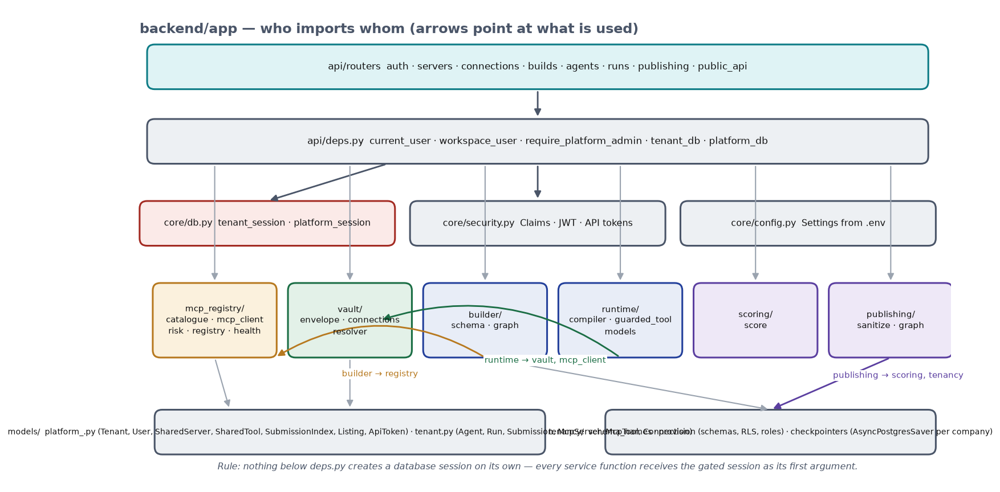
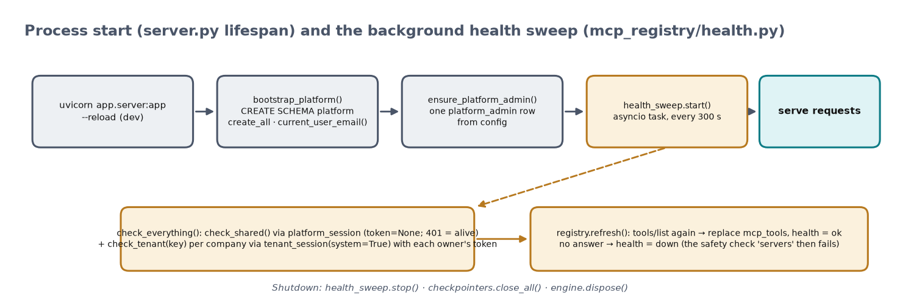
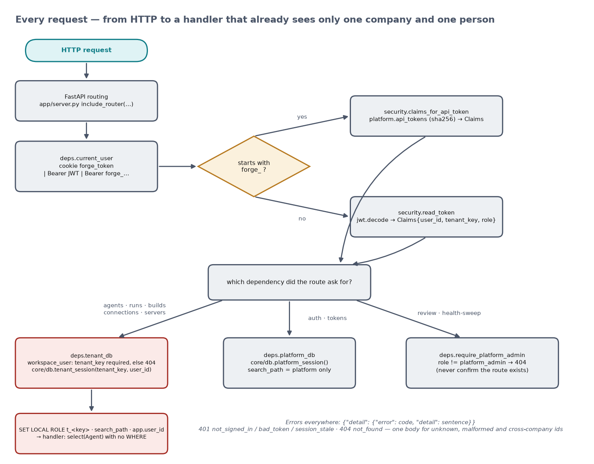
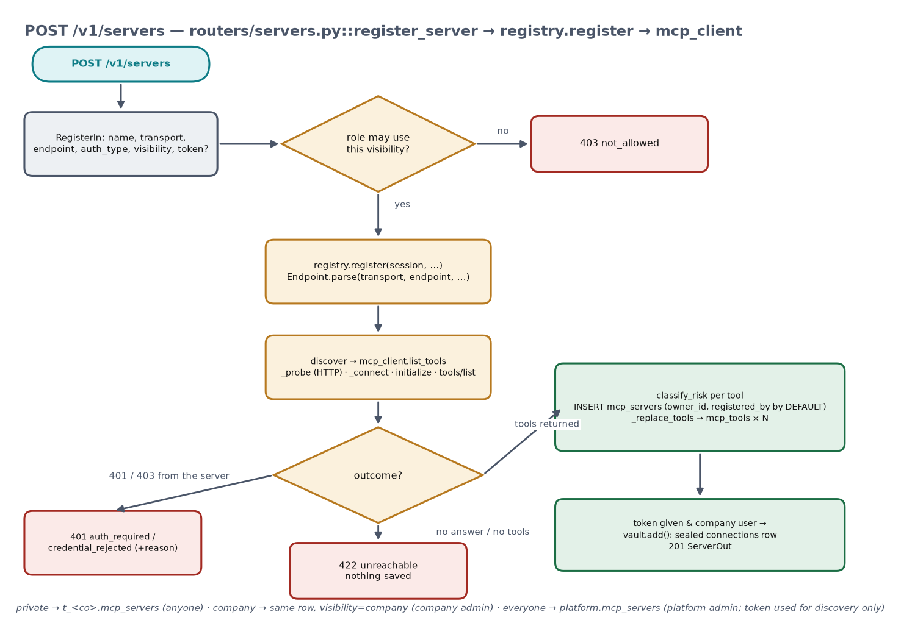
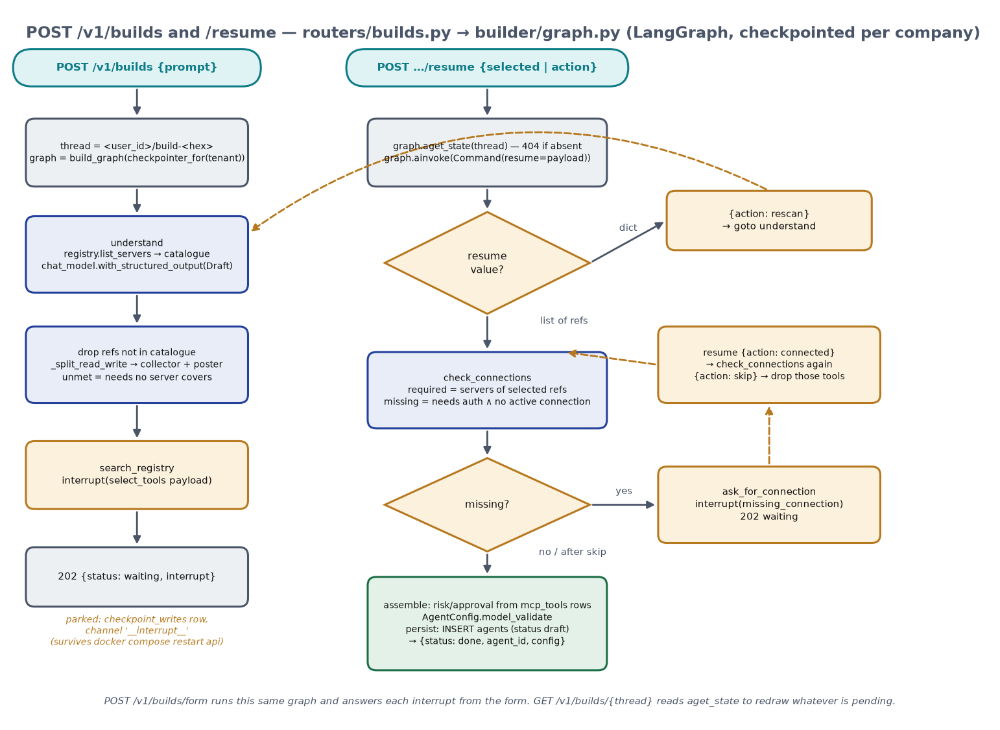
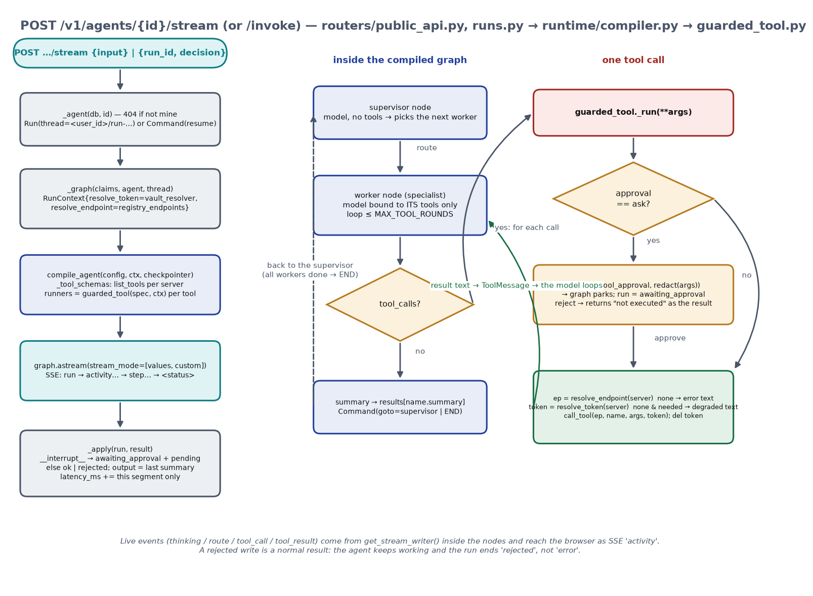
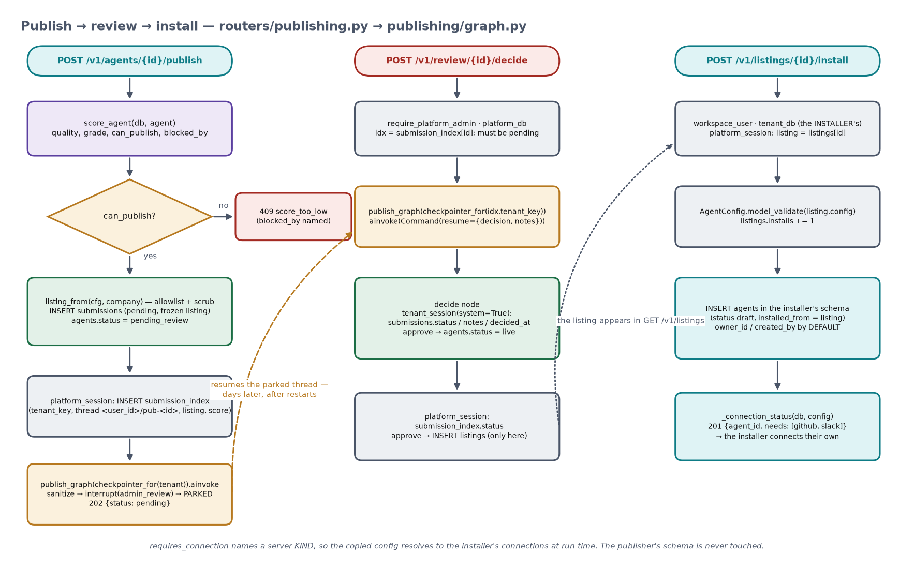

# Backend code walkthrough — `backend/app`, end to end

This is the "read the code with me" document. It follows a request from the HTTP layer to the
database and back, names every function on the way, and says what each one reads and writes.
Every path and function name below exists in the repo. Companion pictures are in `docs/img/`;
each section starts with its flowchart.

Read in order the first time. Afterwards, jump to the endpoint you are debugging in §5.

---

## 0. The three sentences to hold on to

1. **An agent is a JSON document** (`AgentConfig`). The builder writes it, one runtime reads it,
   nothing is generated.
2. **Isolation is set on the database connection, not written into queries.** One function
   (`core/db.py::_point_at`) makes Postgres see one company and one person; handlers then write
   `select(Agent)` with no `WHERE`.
3. **Every pause is a LangGraph `interrupt()`**, persisted by a per-company `AsyncPostgresSaver`.
   Builder (2 pauses), runtime (tool approval), publishing (admin review) all use the same trick.

---

## 1. Layout — what each folder is for



```
backend/app/
  server.py            FastAPI app + lifespan (startup / shutdown)
  core/                config (Settings from .env) · security (Claims, JWT, API tokens) · db (THE GATE)
  api/deps.py          who is asking → Claims; which session the route gets
  api/routers/         one file per screen-ish: auth · servers · connections · builds · agents · runs · publishing · public_api
  tenancy/             schema_names · provision (schemas, RLS, roles) · checkpointers (one saver per company)
  models/              platform_.py (shared tables) · tenant.py (per-company tables)
  mcp_registry/        catalogue · mcp_client (the protocol) · risk · registry (read/write the registry) · health (the sweep)
  vault/               envelope (crypto) · connections (add / use / revoke) · resolver (what a run carries)
  builder/             schema (AgentConfig + validators) · graph (understand → … → persist)
  runtime/             compiler (config → graph) · guarded_tool (the approval gate) · models (Gemini)
  scoring/score.py     quality + safety from rows
  publishing/          sanitize (allowlist projection) · graph (sanitize → admin_review → decide)
backend/tests/         conftest (two throwaway companies) · graded/ (one file per graded check) · unit tests
```

**Layering rule.** Routers → `deps.py` → `core/db.py` → services. Services never open a session
themselves; they receive the gated `AsyncSession` as their first argument. Two exceptions, on
purpose: `vault/resolver.py` and the graphs open `tenant_session(...)` for the person they were
started by (they run outside a request), and `checkpointers.py` has its own psycopg pool because
LangGraph needs one.

---

## 2. Startup — `server.py`



```python
@asynccontextmanager
async def lifespan(app):
    await bootstrap_platform()      # tenancy/provision.py: CREATE SCHEMA platform; create_all; current_user_email()
    await ensure_platform_admin()   # one users row with role platform_admin, from Settings
    health_sweep.start()            # mcp_registry/health.py: asyncio task, every 300 s
    yield
    await health_sweep.stop(); await close_all(); await engine.dispose()
```

- `core/config.py::Settings` reads `.env`: `DATABASE_URL` (as `forge_app`), `GOOGLE_API_KEY`,
  `JWT_SECRET`, `PLATFORM_ADMIN_EMAIL/PASSWORD`, `FORGE_MASTER_KEY`. `GOOGLE_API_KEY` is mirrored
  into `os.environ` because `init_chat_model` reads it from there.
- `core/db.py` creates one SQLAlchemy async engine (`psycopg` driver) and `SessionLocal`.
- The health sweep (`health.check_everything`) walks `platform.mcp_servers` with no token (a 401
  counts as alive) and every company's `mcp_servers` under `tenant_session(key, system=True)`,
  calling `registry.refresh()` for each; a server that stops answering gets `health = down`, which
  later fails the safety check *servers*.

---

## 3. One request, start to finish



### 3.1 Who is asking — `api/deps.py::current_user`

```python
token = creds.credentials if creds else request.cookies.get("forge_token")
if token.startswith("forge_"):           # an API token (Postman, scripts)
    claims = await claims_for_api_token(token)   # sha256 lookup in platform.api_tokens
else:
    claims = read_token(token)            # jwt.decode → Claims
```

`Claims` (`core/security.py`) is a frozen dataclass: `user_id, tenant_id, tenant_key, email, name,
role`. It was issued by `auth.login` / `auth.register` and travels in an httpOnly cookie for the
browser, or as `Authorization: Bearer …` for programs. No database round trip is needed to know
which company a request belongs to — it is in the token.

### 3.2 Which session the route gets

| Dependency | Who may pass | Session | Used by |
|---|---|---|---|
| `workspace_user` | anyone with a `tenant_key` (platform admin → 404) | none, just Claims | builds, runs, publish |
| `tenant_db` | same | `tenant_session(tenant_key, user_id)` | agents, runs, servers, connections, publishing, public_api |
| `platform_db` | anyone signed in | `platform_session()` — `search_path = platform` only | auth, tokens, review, listings |
| `require_platform_admin` | `role == platform_admin` (else 404, never 403) | as above | `/v1/review`, `/health-sweep` |

### 3.3 The gate — `core/db.py::tenant_session` → `_point_at`

```python
async with SessionLocal() as session:
    async with session.begin():                       # ONE transaction per request
        await session.execute(text(f'SET LOCAL ROLE "{schema}"'))                  # company lock
        await session.execute(text(f'SET LOCAL search_path TO "{schema}", platform'))
        await session.execute(text("SELECT set_config('app.user_id', :uid, true)"), {"uid": user_id})  # person lock
        yield session
```

Why `SET LOCAL` and `session.begin()`: LOCAL settings die with the transaction, so a pooled
connection can never carry one request's company into the next request. That is also why nothing
may take a bare connection from the pool.

What the two locks buy (created per company in `tenancy/provision.py::create_tenant`):

- **Role `t_<key>`** has `USAGE` on schema `t_<key>` and `SELECT` on a few `platform` tables.
  An unqualified `agents` can only resolve inside the company; `t_maven.agents` from Northwind's
  role is *permission denied*.
- **Row-level security** on `agents, runs, submissions, connections, mcp_servers` (+ `mcp_tools`
  via its server): `USING (owner_id = current_setting('app.user_id')::uuid OR app.role = 'system')`
  — servers add `OR visibility = 'company'`. `owner_id` **defaults** to the same setting, so no
  handler ever passes an owner. `FORCE` makes it apply to the table owner too; the app connects
  as `forge_app` (`NOBYPASSRLS`) because a superuser would silently skip RLS.

`platform_session()` sets only `search_path = platform`; a tenant table name would not resolve
there at all.

### 3.4 Errors

Every error is `{"detail": {"error": "<code>", "detail": "<sentence>"}}`. `NOT_FOUND` in
`deps.py` is the one 404 body — unknown id, malformed id and another company's id are
indistinguishable (graded check 9). `tenant_db` turns "role does not exist" (database reset with an
old cookie) into `401 session_stale`.

---

## 4. The data the handlers touch

`models/platform_.py` — shared, one copy: `Tenant`, `User`, `SharedServer` + `SharedTool`
(the *Everyone* registry), `SubmissionIndex` (the review queue's pointer rows), `Listing`
(the marketplace), `ApiToken`.

`models/tenant.py` — per company, never a `schema=` argument: `Agent`, `Run`, `Submission`,
`McpServer` + `McpTool`, `Connection`. Every per-person table has:

```python
owner_id   = mapped_column(PgUUID, server_default=CURRENT_USER)         # NULLIF(current_setting('app.user_id'),'')::uuid
created_by = mapped_column(String, server_default=CURRENT_USER_EMAIL)   # platform.current_user_email()
```

so an `INSERT` with neither column set is stamped by Postgres from the session variable. A test
(`test_the_owner_is_stamped_by_the_database_not_the_handler`) proves a handler cannot claim
another owner.

LangGraph's `checkpoints`, `checkpoint_blobs`, `checkpoint_writes`, `checkpoint_migrations` live in
each company schema too (`tenancy/checkpointers.py` opens its pool with
`options=-c search_path=t_<key>` and runs `saver.setup()` there). A pause is a `checkpoint_writes`
row with `channel = '__interrupt__'`.

---

## 5. Endpoint by endpoint — the call chains

### 5.1 Sign-up / sign-in — `routers/auth.py`

```
POST /auth/register {email, password, name, company, intent}
  platform_db → schema_key_for(company)              "Northwind Labs" → "northwind_labs"
  intent=create & exists → 409 company_exists · intent=join & missing → 404 no_such_company
  INSERT tenants (create) · INSERT users (role admin | user) · commit
  create_tenant(key)   (create only): CREATE SCHEMA, create_all, RLS policies, CREATE ROLE, GRANTs
  issue_token(Claims) → Set-Cookie forge_token
POST /auth/login       verify_password (argon2) → issue_token → cookie
GET  /auth/me          Claims → {email, name, company, role}; 401 session_stale if the company is gone
```

### 5.2 Register a server — `routers/servers.py::register_server`



```
allowed = {"everyone": platform admin, "company": company admin, "private": any company user}[visibility]
registry.register(session, name, transport, endpoint, auth_type, credential_env_var, description, visibility, shared_by, token)
  ├─ Endpoint.parse(...)                      mcp_client.py — stdio command line | http/sse URL; ValueError → 422 bad_endpoint
  ├─ discover(ep, token) → list_tools(ep, token)
  │     _connect: http/sse → _probe (plain HTTP initialize: 401/403 → AuthRequired(had_token, reason))
  │               stdio    → subprocess with the credential in env[credential_env_var]
  │     session.initialize(); session.list_tools()
  │     DiscoveredTool(name, description, input_schema, risk=classify_risk(name, description))
  ├─ everyone → SharedServer / SharedTool (platform)     else → McpServer / McpTool (my row of that name; RLS)
  ├─ health = ok, last_checked_at = now; _replace_tools(...)
  └─ ServerView
AuthRequired → 401 auth_required | credential_rejected (server's reason)   ·   ServerUnreachable → 422 unreachable
token given & not platform admin → vault.add(...)   the credential becomes MY connection in the same request
```

Other routes in the file: `GET /v1/servers` (`registry.list_servers` merges shared + company +
mine, nearest wins; `connected` = I hold an active connection or `auth_type == none`),
`GET /v1/servers/catalogue` (the six quick-picks), `POST /{name}/refresh` (`registry.refresh` with
my token for my row, or via `platform_session` for a shared one), `PATCH /{name}` (company admin:
`visibility`), `DELETE /{name}` (owner), `POST /health-sweep` (platform admin).

### 5.3 Connections — `routers/connections.py` → `vault/`

```
POST /v1/connections {server_name, secret}
  vault.add(session, tenant, user_id, server_name, secret, added_by)
    envelope.seal(secret, tenant, user_id, server_name)
      dek = AESGCM.generate_key(256); encrypted_secret = AESGCM(dek).encrypt(nonce, secret, aad)
      encrypted_data_key = AESGCM(master).encrypt(nonce2, dek, aad); aad = f"{tenant}:{user_id}:{server_name}"
    UPDATE my existing row for that server, else INSERT connections
  → ConnectionOut (secret is a constant "••••••••••••")
GET    /v1/connections            my rows (RLS), metadata only
DELETE /v1/connections/{name}     status = revoked, ciphertext wiped
```

Reading it back happens in exactly one function, `vault/connections.py::use(session, tenant,
user_id, server_name) -> str | None` (`envelope.open_`), called by `guarded_tool` per tool call, by
`refresh_server`, and by the health sweep — and `del`'d by every caller.

### 5.4 Build — `routers/builds.py` → `builder/graph.py`



```
POST /v1/builds {prompt}
  thread = f"{claims.user_id}/build-{hex}"                       the owner is part of the key
  graph = build_graph(await checkpointer_for(claims.tenant_key))
  result = graph.ainvoke({prompt, tenant, user, log: []}, thread)  runs until the first interrupt
  _shape(result) → BuildOut{status: waiting | done | nothing_to_do, interrupt, log, agent_id, config}
POST /v1/builds/{thread}/resume {selected: [...]} | {action: rescan | connected | skip}
  graph.aget_state(thread) — 404 if it is not mine (I cannot even name a colleague's thread)
  graph.ainvoke(Command(resume=payload), thread)
GET  /v1/builds/{thread}          aget_state → the pending interrupt, so the page can be redrawn after a restart
POST /v1/builds/form              same graph; answers each interrupt from the form's fields (≤ 4 rounds)
```

The graph (`builder/graph.py`), node by node:

| Node | Reads | Does | Writes to state |
|---|---|---|---|
| `understand` | `registry.list_servers(session)` — this person's catalogue | one `chat_model(...).with_structured_output(Draft)` call under `DESIGN_RULES`; drops refs not in the catalogue; `_split_read_write` forces coordinator + collector + poster when a read tool and a write tool are both chosen; `unmet` = needs the model named that no catalogue server covers | `catalogue, name, description, reasoning, suggested, unmet, instructions, supervisor_instructions, specialists, log` |
| `search_registry` | state | `interrupt({"type": "select_tools", ...})` — **pause 1**; on resume: a `dict` with `action: rescan` → `Command(goto="understand")`; a list → keep the refs that exist | `selected, log` |
| `check_connections` | `Connection.status == active` (mine, RLS); `registry.list_servers` for `auth_type` | `required` = servers of the selected refs; `missing` = required ∧ needs auth ∧ not connected | `required, missing, log` |
| `ask_for_connection` | state | `interrupt({"type": "missing_connection", ...})` — **pause 2**; `connected` → `goto check_connections` (re-check, do not believe); `skip` → drop those tools | `selected, log` |
| `assemble` | `mcp_tools` rows via `registry.list_servers` | `risk = Risk(row.risk)`; `approval = ASK if risk in GUARDED else AUTO`; `_topology()`; `AgentConfig.model_validate(config)` | `config, log` |
| `persist` | — | `INSERT agents(name, config, status="draft")` — `owner_id`/`created_by` by DEFAULT | `agent_id, log` |

Edges: `START → understand → search_registry`; `search_registry` and `ask_for_connection` route
with `Command`; `check_connections → (missing ? ask_for_connection : assemble) → persist → END`.

### 5.5 Agents — `routers/agents.py`

```
GET /v1/agents            select(Agent) — my rows; each card: run count, last run, quality_score, safety_grade
GET /v1/agents/{id}       _agent → AgentDetail{config, graph = cfg.graph_nodes_and_edges(), score = score_agent(...)}
GET /v1/agents/{id}/scores  score_agent(db, agent).as_dict()   also stores quality_score / safety_grade / checks on the row
```

`AgentConfig.graph_nodes_and_edges()` (`builder/schema.py`) derives the picture: `message →
supervisor → each specialist → its servers`, or `message → agent → servers`. The UI draws that;
nothing is hand-maintained.

### 5.6 Run — `routers/runs.py`, `routers/public_api.py` → `runtime/`



```
POST /v1/agents/{id}/invoke {input}            runs.py — one-shot, returns RunOut
POST /v1/agents/{id}/stream {input} | {run_id, decision}   public_api.py — SSE, used by the Playground
  agent = _agent(db, id)                                    404 if not mine
  run = Run(agent_id, input, trigger = api | playground, thread_id = f"{user_id}/run-{hex}")   or the existing run
  graph = _graph(claims, agent, thread)
    cfg = AgentConfig.model_validate(agent.config)
    ctx = RunContext(tenant, thread, resolve_token = vault_resolver(tenant, user_id), resolve_endpoint = registry_endpoints(tenant, user_id))
    compile_agent(cfg, ctx, checkpointer_for(tenant))
  state = _state(run) = {task, transcript: [], finished: [], results: {}}   or Command(resume="approve" | "reject")
  async for mode, chunk in graph.astream(state, thread, stream_mode=["values", "custom"]):
      custom → SSE "activity" {kind: thinking | route | tool_call | tool_result, worker, tool, risk, asks}
      values → SSE "step" per new transcript line
  _apply(run, result, started):
      "__interrupt__" in result → status awaiting_approval, pending = the interrupt payload (tool, risk, redacted args)
      else → finished_at, output = last "*.summary", status = rejected if any result says "Rejected by the user" else ok
      latency_ms += this segment only (human deciding time never counts)
  SSE "<status>" with RunOut
POST /v1/agents/{id}/runs/{run}/resume {decision}   runs.py — same as stream with run_id, without SSE
GET  /v1/agents/{id}/runs · /runs/{run}             history, my rows
POST /v1/agents/{id}/runs/{run}/feedback {value}    runs.feedback = 1 | -1
GET  /v1/agents/{id}/readiness                      per required server: connected | no_credential_needed | needs_credential | not_registered
```

Inside `compile_agent` (`runtime/compiler.py`):

1. `_tool_schemas` — for each `requires_connections` server: `resolve_endpoint` → `list_tools`
   with `resolve_token`, so the model sees the server's **real** argument schema (a dead server
   is logged and skipped: degraded, not crashed).
2. `runners[ref] = guarded_tool(spec, ctx)` — every tool call the model makes lands here.
3. `definitions[ref]` — the tool as the model sees it (`server__tool`, description with risk, the
   schema).
4. Nodes: `supervisor` (a model with **no** tools; prompt lists the remaining specialists and
   their instructions; picks one by name; `finished` tracks who has worked) and one `worker` per
   specialist (model bound only to its own tools; loops ≤ `MAX_TOOL_ROUNDS`; each `tool_call` →
   `runners[ref](**args)`; its summary goes to `results["<name>.summary"]`; returns
   `Command(goto="supervisor")`). A `single` topology is one `agent` worker going to `END`.
5. `RunState` carries `task, transcript, finished, results` — never a token, because the
   checkpointer writes this dict to Postgres.

`guarded_tool._run(**kwargs)` (`runtime/guarded_tool.py`):

```python
if spec.approval is Approval.ASK:
    decision = interrupt({"type": "tool_approval", "tool": spec.ref, "risk": ..., "args": redact(kwargs)})
    if decision != "approve":
        return f"Rejected by the user. {spec.ref} was not executed."     # a normal result, the model continues
ep = await ctx.resolve_endpoint(spec.requires_connection)              # registry.endpoint_for (mine > company > everyone)
if ep is None: return "<server> is not in this workspace's registry."
token = await ctx.resolve_token(spec.requires_connection)              # vault.use → plaintext, this person's row
if token is None and ep.needs_token: return "<server> is not connected …, so <tool> could not run."
try:    return await call_tool(ep, tool_name, kwargs, token)            # mcp_client: initialize + tools/call
finally: del token
```

`call_tool` returns text; a server-side error comes back as `"ERROR from <tool>: …"` (redacted),
never as an exception — the agent stays *degraded*, the run does not crash.

### 5.7 Scoring — `scoring/score.py::score_agent(session, agent)`

```
runs = select(Run).where(agent_id) newest first (my rows)
quality_checks(cfg, runs)  → six Check(key, label, passed, detail, points, max_points)
safety_checks(session, cfg, runs) → five Check(...)   (reads registry.list_servers for live risk + health)
quality = Σ points · grade = {5: A, 4: B, 3: C}.get(passed, "D")
can_publish = quality ≥ 70 and grade ≤ "B"; blocked_by names each failure
agent.quality_score / safety_grade / checks are updated on the row (the caller's transaction commits)
```

`_tools_used` reads the transcripts (`"[worker] server.tool -> …"`) to know which granted tools
actually ran — that feeds both *coverage* (quality) and *least_privilege* (safety).

### 5.8 Publish, review, install — `routers/publishing.py` → `publishing/`



```
GET  /v1/agents/{id}/publish/preview   score_agent + listing_from(cfg, company) → what would leave
POST /v1/agents/{id}/publish
  score_agent → not can_publish → 409 score_too_low {blocked_by}
  an open Submission with status pending → 409 already_pending
  listing = listing_from(cfg, company)                    sanitize.py: allowlist of named fields + scrub() on free text
  INSERT submissions(agent_id, listing, score, status pending); thread_id = f"{user_id}/pub-{sub.id}"; agents.status = pending_review
  platform_session: INSERT submission_index(submission_id, tenant_key, company, owner_id, agent_id, thread_id, listing, quality, grade, checks)
  publish_graph(checkpointer_for(tenant)).ainvoke({...}, thread)   sanitize → interrupt(admin_review) → returns parked
  → 202 SubmissionOut
GET  /v1/review                        platform admin; select(SubmissionIndex) across companies; waiting_hours
POST /v1/review/{id}/decide {decision: approve | changes | reject, notes}
  idx must be pending (409 already_decided)
  publish_graph(checkpointer_for(idx.tenant_key)).ainvoke(Command(resume={decision, notes}), idx.thread_id)
    decide node: tenant_session(tenant, system=True) → submissions.status/notes/decided_at; approve → agents.status = live
                 platform_session → submission_index.status; approve → INSERT listings(...)   ← the only Listing( in the codebase
GET  /v1/listings · /v1/listings/{id}  platform_session; detail adds _connection_status(db, config) for ME
POST /v1/listings/{id}/install
  platform_session: listing; AgentConfig.model_validate(listing.config); installs += 1
  INSERT agents(name, config, status draft, installed_from = listing.id) in MY schema (tenant_db) — owner by DEFAULT
  → 201 {agent_id, name, needs}
```

`listing_from` copies **only**: `schema_version, name, description, model, topology (instructions
scrubbed), tools [ref, risk, approval, requires_connection], policy, requires_connections,
schedule`. `scrub()` removes emails, URLs, `*.internal|local|corp|lan|intranet|test` hosts, IPv4,
`/srv|/home|/users|/var|/etc|/opt` and `C:\` paths, `ABC-1234` ticket refs, secret-shaped strings,
and the company's own name.

### 5.9 API tokens and Postman — `routers/public_api.py`

```
POST /v1/tokens        new_api_token() → (plain "forge_…", sha256, prefix); INSERT api_tokens; plaintext returned once
GET  /v1/tokens        my tokens (prefix, last_used_at)
DELETE /v1/tokens/{id} revoked_at = now
GET  /v1/agents/{id}/postman   mints a token, returns a v2.1 collection: Invoke, Resume (approve/reject), Runs, Readiness, Agent, Stream
```

A request with `Authorization: Bearer forge_…` goes through the same `current_user` → the same
`tenant_db` → the same handlers. Another company's agent id is not in that schema → 404.

---

## 6. The three graphs side by side

| | Builder (`builder/graph.py`) | Runtime (`runtime/compiler.py`) | Publishing (`publishing/graph.py`) |
|---|---|---|---|
| Started by | `POST /v1/builds` | `POST /invoke` · `/stream` | `POST /publish` |
| Thread id | `<user_id>/build-<hex>` | `<user_id>/run-<hex>` | `<user_id>/pub-<submission_id>` |
| State | `BuildState` (prompt, catalogue, selected, missing, config, log…) | `RunState` (task, transcript, finished, results) | `PublishState` (tenant, submission_id, listing, score, decision, notes, log) |
| Pauses | `select_tools`, `missing_connection` | `tool_approval` (inside `guarded_tool`) | `admin_review` |
| Resume value | `[refs]` or `{"action": …}` | `"approve"` / `"reject"` | `{"decision", "notes"}` |
| Resumed by | the same person (`/resume`) | the same person (`/resume`, `/stream`) | the platform admin (`/review/{id}/decide`), routed by `submission_index.tenant_key` |
| Writes at the end | `agents` | `runs` (by the router's `_apply`) | `submissions`, `submission_index`, `listings`, `agents.status` |

All three are compiled with `checkpointer_for(tenant_key)`, so their state lives in the company's
own schema. While any of them is paused, no Python is running for it; a restart changes nothing.

---

## 7. How to trace a request while it happens

1. `docker compose logs -f api` — every request line, the health sweep, tracebacks. Set
   `logging.basicConfig(level=logging.DEBUG)` in `server.py` to also see model fallbacks
   (`runtime/models.py` logs why a model was skipped).
2. pgAdmin, the pause query: `SELECT left(thread_id,60), checkpoint_id FROM t_<co>.checkpoint_writes
   WHERE channel = '__interrupt__' ORDER BY 2 DESC;` — one row per parked build / run / review.
3. `runs.pending` — what a parked run is waiting for; `runs.transcript` — one line per step.
4. `agents.checks` — every score check with its detail, as JSON.
5. The browser's Network tab on `/stream` shows the SSE events (`run`, `activity`, `step`,
   `<status>`) as they arrive.

---

## 8. How to change things safely

**Add an endpoint.** Put it in the router that owns the screen. Ask for `tenant_db` (company data),
`platform_db` (shared data) or `require_platform_admin`; never build a session yourself. Query with
bare model names and no owner/tenant filter — RLS and the role do that. Return
`HTTPException(404, detail=NOT_FOUND)` for anything you cannot find.

**Add a column to a company table.** Add it to `models/tenant.py`; for a per-person table keep
`owner_id` and its `*_by` twin. There is no Alembic yet: existing schemas need an `ALTER TABLE`
per schema (loop over `pg_namespace` like the migration in `docs/VERIFY.md`), or
`docker compose down -v`. New companies get it from `create_all`.

**Add a node or a pause to a graph.** Add the node function, wire it in `build_graph` /
`publish_graph`, and if it pauses call `interrupt(payload)` and teach the router's resume model
what the answer looks like. Never put a credential in the state or the payload — it would be on
disk in `checkpoint_writes` forever.

**Add a tool server type.** `mcp_client.Endpoint.parse` decides transports; `_connect` opens the
session. Everything above it only sees `list_tools` / `call_tool`.

**Change what may be published.** Only `publishing/sanitize.py::listing_from` — it is an allowlist,
so add the field there deliberately. `test_check_04_sanitize.py` will tell you if something planted
leaks.

---

## 9. Glossary

| Term | Meaning here |
|---|---|
| Claims | the decoded identity of a request: `user_id, tenant_id, tenant_key, email, name, role` |
| tenant / company / workspace | one schema `t_<schema_key>` plus a Postgres role of the same name |
| the gate | `core/db.py::tenant_session` → `_point_at`: role + `search_path` + `app.user_id` inside one transaction |
| RLS | Postgres row-level security; policy `owner_id = current_setting('app.user_id')` |
| system context | `app.role = 'system'`: the health sweep and the publish `decide` node; never a request |
| MCP | Model Context Protocol; `initialize`, `tools/list`, `tools/call` over stdio / HTTP / SSE |
| risk | `read` / `write` / `destructive`, from `risk.classify_risk` at discovery time |
| approval | `auto` / `ask`; derived from risk at `assemble`; enforced in `guarded_tool` |
| interrupt | LangGraph's pause; `interrupt(payload)` parks the graph, `Command(resume=value)` continues and the call returns `value` |
| checkpointer | `AsyncPostgresSaver` bound to one company schema (`tenancy/checkpointers.py`) |
| thread id | the key of a parked graph, always prefixed by the owner's `user_id` |
| listing | the sanitized projection of an `AgentConfig` that the marketplace shows and installs |
