# Technical Design — HLD & LLD (as built)

Agent Platform Capstone "Forge" · Data Sense · team of four · submission 20 September 2026

**Companion documents**
- `docs/ARCHITECTURE.md` — the same system in plain language
- `docs/VERIFY.md` — what each screen writes to the database, and the queries to see it
- `README.md` — run it, accounts, credentials, tests
- `docs/BACKEND.md` — the code walkthrough: request lifecycle, call chain per endpoint, the three graphs, how to extend

Everything below describes the code in `backend/app` and `Frontend/src` as it is today. Every
file path is real.

---

# PART I — HIGH LEVEL DESIGN

## 1. System context

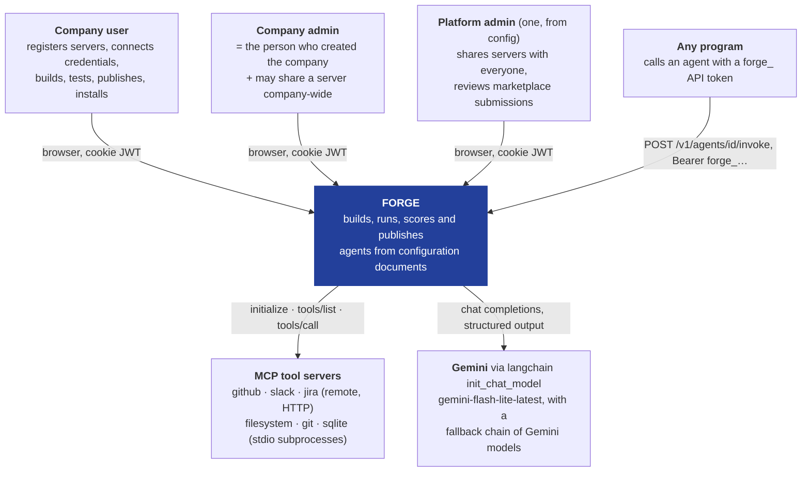

**Boundary rules.** Credentials cross inward only; nothing decrypted crosses back out. Agent
designs cross between companies only through the marketplace, only after admin approval, only as
the sanitized projection. No paid service is on any path.

---

## 2. Container view

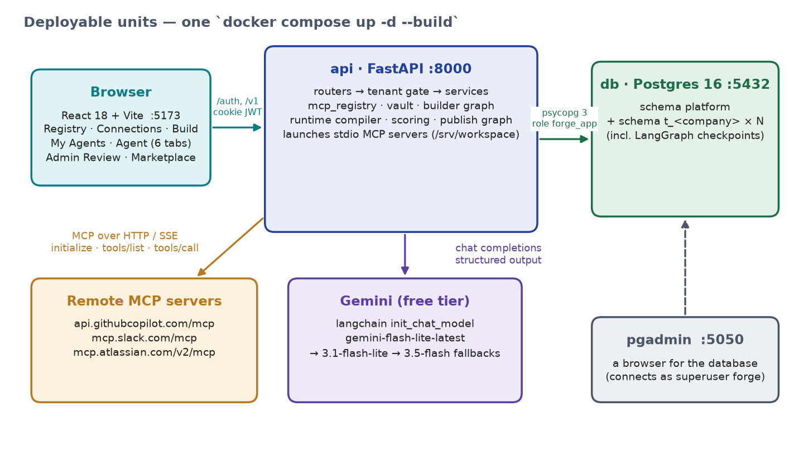

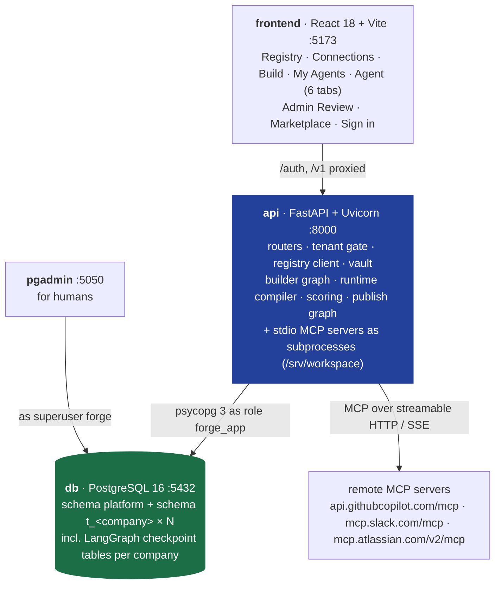

`docker compose up -d --build` starts all four. `backend/app` and `Frontend/` are bind-mounted so
both reload on edit; data lives in named volumes (`pgdata`, `forge_workspace`, `forge_var`).

---

## 3. Component view — inside `api`

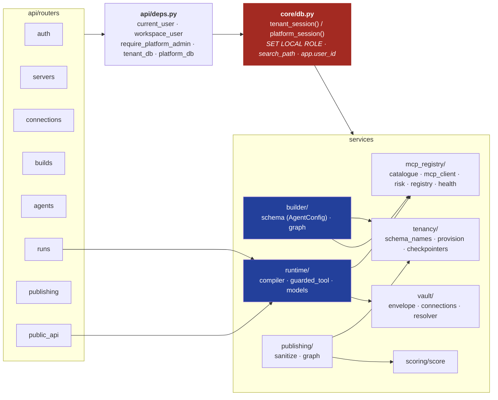

**Dependency rule.** No router touches a table without a session from `core/db.py`, and there is no
other way to get one. Every service function takes that session as its first argument.

---

## 4. Cross-cutting: tenancy and identity

| Concern | Decision (as built) |
|---|---|
| Company model | one database; one schema `t_<schema_key>` per company + shared `platform` schema; created on sign-up by `tenancy/provision.py::create_tenant` |
| Company lock | `SET LOCAL ROLE "t_<key>"` + `SET LOCAL search_path TO "t_<key>", platform` per request transaction; the role has `USAGE` on its own schema only |
| Person lock | `set_config('app.user_id', …)` per request; `FORCE ROW LEVEL SECURITY` + policy `owner_id = current_setting('app.user_id')` on `agents, runs, submissions, connections, mcp_servers` (`OR visibility='company'` for servers), `mcp_tools` via its server; `owner_id DEFAULT` that setting |
| Readable twin | `created_by / run_by / submitted_by / registered_by / added_by` default to `platform.current_user_email()` |
| DB role | app connects as `forge_app` — `NOSUPERUSER NOBYPASSRLS CREATEROLE` (`docker/db/init.sql`); pgAdmin as superuser `forge` |
| Roles | `platform_admin` (one, from config, `tenant_id NULL`) · `admin` (created the company) · `user` (joined it) |
| Sign-up | `intent = create` → company must not exist, you are admin; `intent = join` → company must exist, you are a user; mismatches are refused (`409 company_exists`, `404 no_such_company`) |
| Session | JWT in an httpOnly cookie: `sub, tid, tenant_key, email, name, role`; or `Authorization: Bearer forge_…` (API token) resolved to the same `Claims` |
| Checkpoints | LangGraph tables live inside each company schema (`AsyncPostgresSaver` per company, `options=-c search_path=t_<key>`); thread ids are `<user_id>/…` |
| System context | `app.role = 'system'` only for the health sweep and for applying an admin decision in the author's schema |
| Not found | zero rows → `404 {"error": "not_found"}`; never 403 |

---

## 5. Tech stack

| Layer | Choice | Why |
|---|---|---|
| API | FastAPI + Uvicorn | async-native for LangGraph and the MCP SDK; Pydantic validates the agent document |
| ORM / driver | SQLAlchemy 2 async + psycopg 3 | one driver for both SQLAlchemy and `langgraph-checkpoint-postgres`; `SET LOCAL` scoped by `session.begin()` |
| Database | PostgreSQL 16 | schemas + roles + RLS + JSONB + the official LangGraph checkpointer, all at once |
| Migrations | none yet — `metadata.create_all` per schema; `docker compose down -v` to reset | Alembic (two trees) is the known gap |
| Agent runtime | LangGraph 1.x, `interrupt()` + `AsyncPostgresSaver` | durable pause/resume *is* checks 5 and 6 |
| Model | `langchain.init_chat_model` → Gemini `gemini-flash-lite-latest` with fallbacks `gemini-3.1-flash-lite`, `gemini-3.5-flash` | free tier; a rate limit mid-demo falls through to the next model, tools bound to every link |
| Tools | MCP Python SDK (`mcp>=2`) | `initialize`, `tools/list`, `tools/call` over stdio / streamable HTTP / SSE |
| Crypto | `cryptography` AES-256-GCM envelope | AAD `company:user:server` binds a row to its owner |
| Auth | PyJWT + argon2 | stateless claims carry `tenant_key`, `user_id`, `role` |
| Frontend | React 18 + Vite, no UI framework | SSE streaming in the Playground; screens follow the brief's mockups |
| Packaging | Docker Compose | `docker compose up` is a submission requirement |

---

## 6. Non-functional requirements → the nine checks

| # | Check | Design element | Where |
|---|---|---|---|
| 1 | Isolation with the filter removed | schema + role per company, RLS per person | §4, LLD §8 |
| 2 | Credential appears nowhere | envelope encryption; names only in state; `redact()` | LLD §7.2, §9 |
| 3 | Unguarded write cannot publish | validator + `assemble()` + safety check 1 + `409` | LLD §11.1 |
| 4 | Planted material stripped | allowlist projection + scrub | LLD §11.2 |
| 5 | Kill mid-build, resume | `interrupt()` + per-company checkpointer | LLD §7.3 |
| 6 | Approval overnight resumes | publish graph parked; index routes the resume | LLD §7.5 |
| 7 | Multi-agent demo with approval | supervisor topology; approval in the wrapper | LLD §7.4 |
| 8 | Postman collection works | server-generated v2.1, token pre-filled | LLD §12 |
| 9 | Cross-company id → 404 | zero rows, no ownership branch | LLD §8.3 |

---

# PART II — LOW LEVEL DESIGN

## 7. Behaviour — sequence diagrams (the six steps)

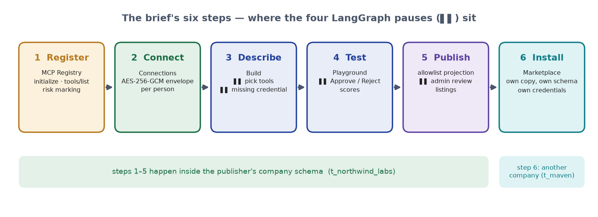

### 7.1 Register a tool server (step 1)

```mermaid
sequenceDiagram
    autonumber
    actor U as Priya
    participant API as routers/servers.py
    participant R as mcp_registry/registry.py
    participant C as mcp_registry/mcp_client.py
    participant M as MCP server
    participant DB as Postgres (t_northwind_labs)

    U->>API: POST /v1/servers {name, transport, endpoint, auth_type, visibility, token?}
    API->>API: may this role use this visibility? (private: any user · company: admin · everyone: platform admin)
    API->>R: register(...)
    R->>C: Endpoint.parse → _probe (HTTP initialize; 401/403 → AuthRequired)
    R->>C: list_tools(ep, token)
    C->>M: initialize · tools/list
    M-->>C: [{name, description, inputSchema}]
    R->>R: classify_risk(name, description) per tool
    alt answered with tools
        R->>DB: INSERT mcp_servers (health=ok, owner_id/registered_by by default) · INSERT mcp_tools × N
        API->>DB: token given and caller is a company user → vault.add(): INSERT connections
        API-->>U: 201 ServerOut {tools[], risks, connected}
    else 401 without a token
        API-->>U: 401 auth_required — nothing saved
    else rejected the token
        API-->>U: 401 credential_rejected (server's reason) — nothing saved
    else no answer / no tools
        API-->>U: 422 unreachable — nothing saved
    end
```

`classify_risk` is deterministic (`mcp_registry/risk.py`): destructive verb anywhere → destructive;
read verb as the first word → read; write verb anywhere → write; otherwise read. Camel-case names are
split. The company admin may later `PATCH /v1/servers/{name} {visibility}`; the owner may `DELETE`.

### 7.2 Connect (step 2)

```mermaid
sequenceDiagram
    autonumber
    actor U as Priya
    participant API as routers/connections.py
    participant V as vault/connections.py + envelope.py
    participant DB as Postgres

    U->>API: POST /v1/connections {server_name: "slack", secret: "xoxp-…"}
    API->>V: add(tenant, user_id, server_name, secret)
    V->>V: dek = AESGCM.generate_key(256)
    V->>V: encrypted_secret = AESGCM(dek).encrypt(nonce, secret, aad="northwind_labs:<user>:slack")
    V->>V: encrypted_data_key = AESGCM(master).encrypt(nonce2, dek, aad); del dek
    V->>DB: INSERT/UPDATE connections (4 bytea columns, master_key_version, status=active, added_by)
    API-->>U: 201 ConnectionOut {server_name, status, added_by, secret: "••••••••••••"}
    Note over API,U: ConnectionOut.secret is a constant. No endpoint can return a value.
```

### 7.3 Build an agent — the two graded pauses (step 3)

```mermaid
sequenceDiagram
    autonumber
    actor U as Priya
    participant API as routers/builds.py
    participant G as builder/graph.py
    participant CP as AsyncPostgresSaver (t_northwind_labs.checkpoints*)
    participant DB as Postgres

    U->>API: POST /v1/builds {prompt}
    API->>G: ainvoke({prompt, tenant, user}, thread_id="<user_id>/build-…")
    G->>DB: understand: registry.list_servers(session) — this person's catalogue
    G->>G: one structured call → Draft {name, description, tool_refs, specialists, unmet}
    G->>G: read-then-write → coordinator + collector + poster
    G->>CP: checkpoint
    G-->>API: interrupt select_tools {name, suggested, specialists, unmet, catalogue}
    API-->>U: 202 {thread_id, status: waiting, interrupt}
    Note over G,CP: NOTHING IS RUNNING. checkpoint_writes has a row with channel='__interrupt__'.<br/>docker compose restart api here — GET /v1/builds/{thread} returns the same interrupt (check 5).

    opt the design named a server this person does not have
        U->>API: POST …/resume {action: "rescan"}   (after registering it)
        API->>G: Command(resume) → goto understand → new select_tools
    end

    U->>API: POST /v1/builds/{thread}/resume {selected: [...]}
    API->>G: Command(resume=selected)
    G->>DB: check_connections: active connections ∩ servers needing auth
    alt something missing
        G->>CP: checkpoint
        G-->>API: interrupt missing_connection {missing, required}
        API-->>U: 202 waiting
        U->>API: POST …/resume {action: "connected" | "skip"}
        API->>G: Command(resume) → "connected" re-checks; "skip" drops those tools
    end
    G->>DB: assemble: risk/approval from mcp_tools rows; AgentConfig.model_validate
    G->>DB: persist: INSERT agents (status=draft; owner_id, created_by by default)
    G-->>API: {agent_id, config}
    API-->>U: 202 {status: done, agent_id, config}
```

`POST /v1/builds/form` starts the same graph and answers each interrupt from the form's fields —
the builder exists once.

### 7.4 Run in the Playground with an approval (step 4)

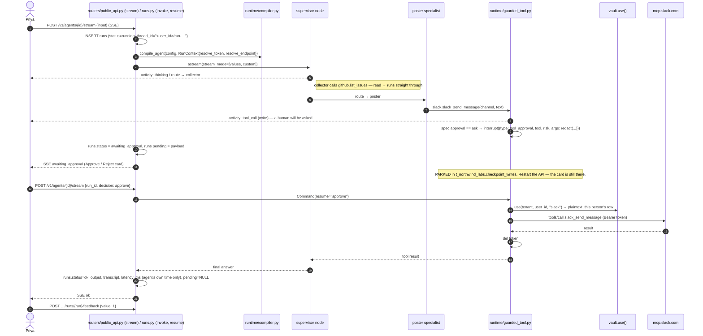

### 7.5 Publish → admin review (step 5)

```mermaid
sequenceDiagram
    autonumber
    actor U as Priya
    participant API as routers/publishing.py
    participant SC as scoring/score.py
    participant P as publishing/graph.py
    participant T as t_northwind_labs
    participant PL as platform
    actor A as admin@forge.dev

    U->>API: GET /v1/agents/{id}/publish/preview
    API->>SC: score_agent → quality, grade, can_publish, blocked_by
    API-->>U: {listing (sanitized), quality, grade, can_publish, blocked_by}
    U->>API: POST /v1/agents/{id}/publish
    alt below the gate
        API-->>U: 409 score_too_low "quality 63 is below 70"
    else
        API->>T: INSERT submissions (listing, score, status=pending); agents.status=pending_review
        API->>PL: INSERT submission_index (tenant_key, company, owner_id, agent_id, thread_id, listing, quality, grade, checks)
        API->>P: ainvoke(thread_id="<user_id>/pub-<submission>") → sanitize → interrupt admin_review
        API-->>U: 202 SubmissionOut {status: pending}
    end
    Note over P,T: PARKED in the author's schema. Days, restarts, weekends.

    A->>API: GET /v1/review   (platform admin; reads submission_index across companies)
    A->>API: POST /v1/review/{submission}/decide {decision: approve|changes|reject, notes}
    API->>P: checkpointer_for(idx.tenant_key) → Command(resume={decision, notes})
    P->>T: decide (system): submissions.status/notes/decided_at; agents.status=live on approve
    P->>PL: submission_index.status; on approve INSERT listings (the only place Listing( is built)
    API-->>A: QueueItem
```

### 7.6 Install from the marketplace (step 6)

```mermaid
sequenceDiagram
    autonumber
    actor R as Riya @ Maven
    participant API as routers/publishing.py
    participant PL as platform.listings
    participant T as t_maven

    R->>API: GET /v1/listings · GET /v1/listings/{id}
    API-->>R: cards; detail with connections: {github: not_registered, slack: needs_credential …}
    R->>API: POST /v1/listings/{id}/install
    API->>PL: SELECT config; AgentConfig.model_validate; installs += 1
    API->>T: INSERT agents (config, status=draft, installed_from=listing) — owner_id = Riya by default
    API-->>R: 201 {agent_id, name, needs: ["github", "slack"]}
    R->>API: GET /v1/agents/{new}/readiness → missing: [github, slack]
    Note over R,T: Priya's schema was never touched. requires_connection says "slack", not whose.
```

---

## 8. Data model

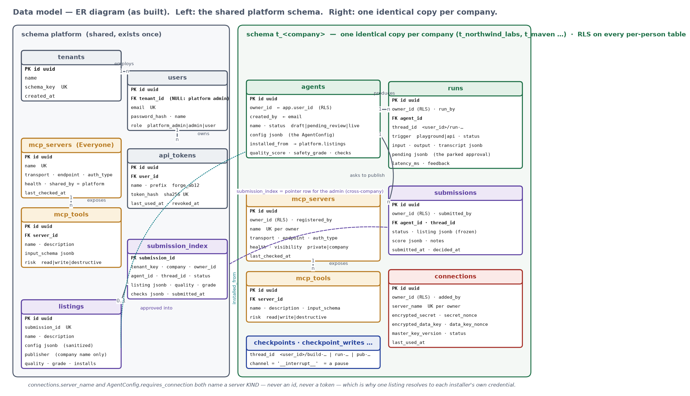

### 8.1 `platform` schema (shared, exists once)

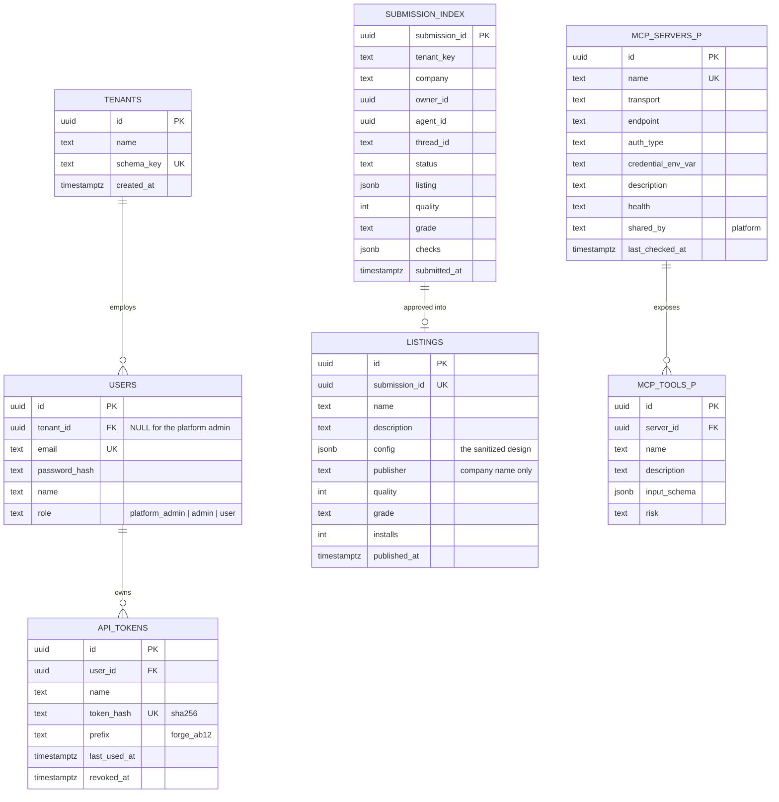

### 8.2 `t_<company>` schema (one identical copy per company)

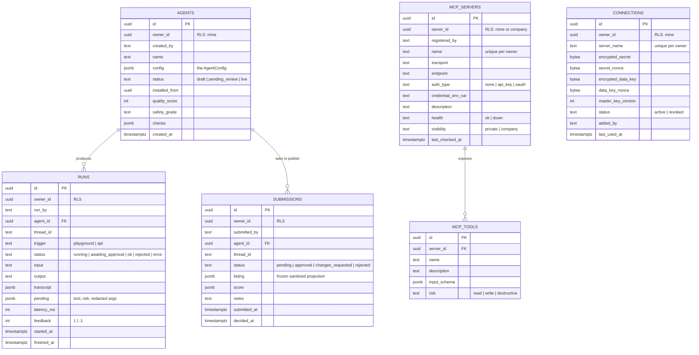

Plus LangGraph's `checkpoints`, `checkpoint_blobs`, `checkpoint_writes`, `checkpoint_migrations`
in every company schema, created by `AsyncPostgresSaver.setup()` on first use. A pause is a
`checkpoint_writes` row with `channel = '__interrupt__'`.

### 8.3 The 404 rule

```python
async def _agent(db, agent_id):
    row = await db.scalar(select(Agent).where(Agent.id == agent_id))   # no tenant clause, no owner clause
    if row is None:
        raise HTTPException(404, detail=NOT_FOUND)                       # identical body, always
    return row
```

---

## 9. Class model — the document and the runtime

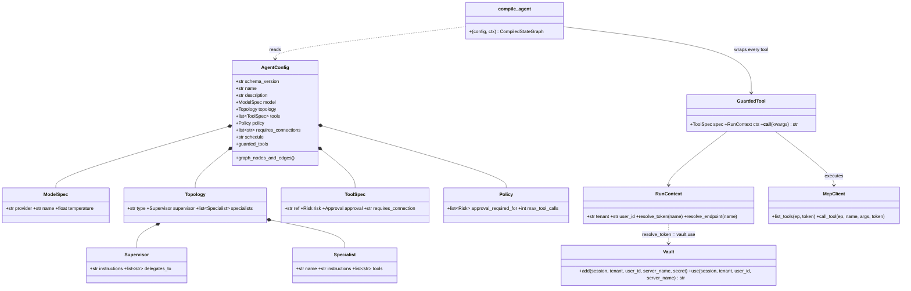

No class holds a token as a field. `Vault.use()` returns one into a local inside
`GuardedTool.__call__`, which is `del`'d in `finally`.

---

## 10. State machines

### 10.1 Agent

```mermaid
stateDiagram-v2
    [*] --> draft : builder persists / marketplace install
    draft --> pending_review : Publish (quality ≥ 70 and grade ≥ B)
    pending_review --> live : admin approves
    pending_review --> pending_review : admin requests changes / rejects (submission carries the notes; author may resubmit)
    live --> pending_review : Publish again
```

*Degraded* is not a stored status: it is computed per run (a required connection missing or a
server down) and shown by the readiness check and the safety checks.

### 10.2 Run

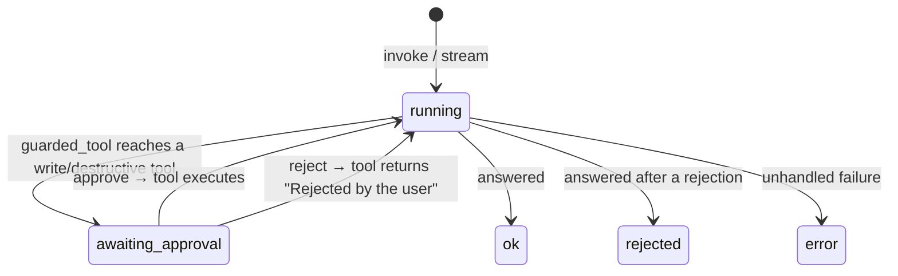

### 10.3 Build thread

```mermaid
stateDiagram-v2
    [*] --> understand
    understand --> select_tools : ⏸ interrupt
    select_tools --> understand : resume {action: rescan}
    select_tools --> check_connections : resume [refs]
    check_connections --> missing_connection : ⏸ interrupt (something missing)
    missing_connection --> check_connections : resume {action: connected}
    missing_connection --> assemble : resume {action: skip}
    check_connections --> assemble : all present
    assemble --> persist --> [*]
```

---

## 11. Key algorithms

### 11.1 Approval derivation (check 3) — `builder/graph.py::assemble`, `builder/schema.py`

```python
risk = Risk(row.risk)                                    # from the REGISTRY row, not from anyone's word
approval = Approval.ASK if risk in GUARDED else Approval.AUTO   # GUARDED = {write, destructive}
# and, independently, AgentConfig's validator refuses a write/destructive tool declared auto
```

### 11.2 Sanitize — allowlist projection (check 4) — `publishing/sanitize.py`

```python
def listing_from(cfg: AgentConfig, *, company: str) -> dict:
    return {                                              # ONLY these keys exist on the other side
        "schema_version": cfg.schema_version,
        "name": scrub(cfg.name, company), "description": scrub(cfg.description, company),
        "model": {...}, "topology": {... instructions scrubbed ...},
        "tools": [{ref, risk, approval, requires_connection}], "policy": {...},
        "requires_connections": [...], "schedule": cfg.schedule,
    }

scrub() replaces: emails · URLs · *.internal/.local/.corp/.lan/.intranet/.test hosts · IPv4 ·
/srv|/home|/users|/var|/etc|/opt paths and C:\ paths · ABC-1234 ticket refs · secret-shaped strings ·
the company's own name
```

### 11.3 Scoring — `scoring/score.py`

```
MIN_RUNS = 1 · RECENT_RUNS = 20 · LATENCY_LIMIT_MS = 90_000 · PUBLISH_MIN_QUALITY = 70 · PUBLISH_MIN_GRADE = "B"

quality = 20·tested(n ≥ 1) + 30·success_rate(last 20) + 20·thumbs_up_ratio
        + 15·every_granted_tool_used + 10·median_latency ≤ 90 s + 5·no_error_in_last_5

safety  = 5 booleans → 5:A 4:B 3:C else D
          approvals · servers (registered, healthy, tool present) · secrets · least_privilege · tested

can_publish = quality ≥ 70 and grade ≤ "B";  blocked_by names each failing reason
```

Finished runs are `ok | rejected | error`; only `ok` counts as success. `latency_ms` sums the agent's
own working segments, excluding the time a human spent deciding.

### 11.4 Risk classification — `mcp_registry/risk.py`

```
words = split(name) ∪ words(description)      (snake_case and camelCase aware)
if words ∩ DESTRUCTIVE (delete, drop, remove, destroy, truncate, purge, revoke, erase, wipe, clear, prune, discard, reset, execute) → destructive
if first word ∈ READ (get, list, search, read, fetch, show, describe, find, query, count, view, check, lookup, browse, inspect) → read
if words ∩ WRITE (create, add, post, send, update, write, set, put, patch, close, merge, commit, push, checkout, …) → write
else → read
```

---

## 12. API contract (as implemented)

| Method | Path | Who | Notes |
|---|---|---|---|
| POST | `/auth/register` | — | `{email, password, name, company, intent: create\|join}`; create → schema + role + admin; join → user |
| POST | `/auth/login` · `/auth/logout` · GET `/auth/me` | — / cookie | cookie JWT; `401 session_stale` if the company is gone |
| GET | `/v1/servers` | any | my three-layer registry (platform admin: the Everyone layer) |
| GET | `/v1/servers/catalogue` | any | the six vendor quick-picks |
| POST | `/v1/servers/discover` | any | step one of connecting: reach the server and **list** its tools with risk; saves nothing (no server, no token); each tool carries `selectable` - `false` for a destructive tool when the caller is an ordinary user |
| POST | `/v1/servers` | any (visibility gated) | discovers via `tools/list` first; `401 auth_required / credential_rejected`, `422 unreachable`, `409 already_exists` (never overwrites); `enabled_tools` = the admin's allow-list (omit = all on; every tool is stored either way), `422` for an unknown tool name; `403 destructive_not_allowed` if an ordinary user ticks a destructive tool (omit the pick and it is simply left off) |
| POST | `/v1/servers/{name}/refresh` | any | re-check now |
| PATCH | `/v1/servers/{name}` | admin, owner only | edit a server I own; `enabled_tools` replaces the allow-list (no network); re-introspects only if the address or credential changed, and tools first seen then start **off**; may flip `visibility` private↔company (company admin); `403` non-admin, `404` not mine |
| DELETE | `/v1/servers/{name}` | admin, owner only | delete a server I own and its tools (204); saved connections stay for their owners to revoke |
| POST | `/v1/servers/health-sweep` | platform admin | run the 5-minute sweep now |
| GET/POST | `/v1/connections` · DELETE `/{server_name}` | workspace | POST seals; nothing ever returns a secret |
| POST | `/v1/builds` · `/v1/builds/form` | workspace | 202 `{thread_id, status: waiting\|done, interrupt, log, agent_id, config}` |
| POST | `/v1/builds/{thread}/resume` | workspace | `{selected}` · `{action: rescan\|connected\|skip}` |
| GET | `/v1/builds/{thread}` | workspace | what is it waiting for (survives restarts) |
| GET | `/v1/agents` · `/v1/agents/{id}` · `/{id}/scores` | workspace | detail carries `config`, `graph`, `score`; 404 across companies |
| DELETE | `/v1/agents/{id}` | workspace, owner only | `404` otherwise; removes runs, submissions and their checkpoints; `409` while a submission awaits review; a published listing stays |
| POST | `/v1/agents/{id}/invoke` | cookie or `forge_` token | 202 RunOut; `awaiting_approval` with `pending` |
| POST | `/v1/agents/{id}/runs/{run}/resume` | cookie or token | `{decision: approve\|reject}` |
| GET | `/v1/agents/{id}/runs` · `/runs/{run}` | workspace | history |
| POST | `/v1/agents/{id}/runs/{run}/feedback` | workspace | `{value: 1\|-1}` |
| GET | `/v1/agents/{id}/readiness` | workspace | per-server: connected · no_credential_needed · needs_credential · not_registered |
| POST | `/v1/agents/{id}/stream` | cookie or token | SSE: `run`, `activity`, `step`, then `ok\|awaiting_approval\|rejected\|error`; body `{input}` or `{run_id, decision}` |
| GET | `/v1/agents/{id}/postman` | workspace | v2.1 collection with a fresh token in `token` |
| GET/POST/DELETE | `/v1/tokens` | workspace | plaintext shown once on create |
| GET | `/v1/agents/{id}/publish/preview` | workspace | the sanitized listing + gate result |
| POST | `/v1/agents/{id}/publish` | workspace | `409 score_too_low` / `already_pending`; 202 pending |
| GET | `/v1/agents/{id}/submissions` | workspace | decisions and notes back to the author |
| GET | `/v1/review` · POST `/v1/review/{id}/decide` | platform admin | `{decision: approve\|changes\|reject, notes}` |
| GET | `/v1/listings` · `/v1/listings/{id}` | workspace | marketplace; detail adds `connections` status for *me* |
| POST | `/v1/listings/{id}/install` | workspace | 201 `{agent_id, name, needs}` |

Error shape everywhere: `{"detail": {"error": "<code>", "detail": "<sentence>"}}`. `not_found` is
byte-identical for unknown, malformed and cross-company ids.

---

## 13. Module layout (as in the repo)

```
backend/app/
  server.py                FastAPI app; lifespan: bootstrap_platform, ensure_platform_admin, health sweep
  core/
    config.py              Settings: DATABASE_URL, GOOGLE_API_KEY, JWT_SECRET, PLATFORM_ADMIN_*, FORGE_MASTER_KEY
    security.py            Claims, argon2, JWT, API tokens (forge_ prefix, sha256)
    db.py                  tenant_session() / platform_session() — the gate
  api/
    deps.py                current_user (cookie | Bearer JWT | forge_ token), workspace_user, require_platform_admin, tenant_db, platform_db
    routers/               auth · servers · connections · builds · agents · runs · publishing · public_api
  tenancy/
    schema_names.py        schema_for(tenant_key) → "t_<key>" (validated)
    provision.py           bootstrap_platform, ensure_platform_admin, create_tenant (schema, tables, RLS, role), drop_tenant
    checkpointers.py       checkpointer_for(tenant_key) → AsyncPostgresSaver bound to that schema
  models/
    platform_.py           Tenant, User, SharedServer, SharedTool, SubmissionIndex, Listing, ApiToken
    tenant.py              Agent, Run, Submission, McpServer, McpTool, Connection   (never a schema= kwarg)
  mcp_registry/
    catalogue.py           the six vendor quick-picks
    mcp_client.py          Endpoint, AuthRequired, _probe, list_tools, call_tool (stdio / http / sse)
    risk.py                classify_risk
    registry.py            list_shared, list_servers, connected_servers, endpoint_for, register, refresh
    health.py              check_shared, check_tenant, check_everything, the 300 s loop
  vault/
    envelope.py            seal / open_ (AES-256-GCM envelope, AAD company:user:server)
    connections.py         add / use / revoke — the only place plaintext exists
    resolver.py            vault_resolver, registry_endpoints — what a RunContext carries
  builder/
    schema.py              AgentConfig and friends; validators (approval, secret shapes, refs); graph_nodes_and_edges
    graph.py               understand → search_registry ⏸ → check_connections → ask_for_connection ⏸ → assemble → persist
  runtime/
    compiler.py            compile_agent: supervisor + specialists or single; activity events
    guarded_tool.py        redact, guarded_tool — the approval gate
    models.py              Gemini via init_chat_model, fallback chain, tools bound to every link
  scoring/score.py         quality_checks, safety_checks, score_agent
  publishing/
    sanitize.py            scrub, listing_from
    graph.py               sanitize → admin_review ⏸ → decide
backend/tests/             conftest (two throwaway companies, three people) · graded/ (one file per check) · unit tests
Frontend/src/
  api.js · App.jsx · Shell.jsx · ui.jsx · style.css · extra.css
  pages/  SignIn · Registry · Connections · Build · MyAgents · AgentDetail (+ ApiTab, Playground, Settings) · AdminReview · Marketplace
docker/db/init.sql         creates the forge_app role
docker-compose.yml · Dockerfile · Frontend/Dockerfile
```

---

## 14. Verification

- `uv run pytest backend/tests` — **172 passed, 1 skipped** (the opt-in live-model test). One file
  per graded check under `backend/tests/graded/`, against a real Postgres with two throwaway companies.
- `docs/VERIFY.md` — the pgAdmin queries that show every claim above, including the
  `__interrupt__` row during each pause and the psql demonstration of both locks.
- Manual: `docker compose restart api` during pause 1, pause 2, a playground approval and a pending
  review — each is still there on reload.

## 15. Known gaps

| Gap | Today | Production answer |
|---|---|---|
| Migrations | `create_all` per schema; `docker compose down -v` to change a model | Alembic with two trees (platform, tenant template) and a loop over every schema |
| Joining a company | anyone who knows the name may join as a user | admin invite links |
| Slack posting | needs a channel **ID** (`C0…`) the app is a member of; a user OAuth token (`xoxp-`) | unchanged — a Slack constraint |
| Model quality | a small free model occasionally over-selects a tool; pause 1 is where the person corrects it | a larger model behind the same `ModelSpec` |
| After *request changes* | `publishing/graph.py::decide` sets `agents.status = live` only on approve; after changes/reject the agent stays `pending_review` (the submission row carries the notes and the author may publish again) | set the agent back to `draft` on any non-approve decision — one line |
