# Technical Design — HLD & LLD

Agent Platform Capstone · Data Sense · team of four · submission 20 September

**Companion documents**
- `docs/ARCHITECTURE.md` — the same system in plain language, no jargon
- `docs/architecture.drawio` — the block diagrams (5 pages)
- **This file** — the technical design: HLD, LLD, UML, contracts, algorithms

> **Is the drawio aligned with this?** Yes. Both were written from the same approved plan.
> `architecture.drawio` page 1 = HLD §2 here; page 2 = §4; page 3 = §7.3; page 4 = §7.4; page 5 = §7.5.
> The drawio shows *structure*; this file adds *behaviour* (sequence, state, contracts).

---

# PART I — HIGH LEVEL DESIGN (HLD)

## 1. System context

Who touches the system and what crosses the boundary.

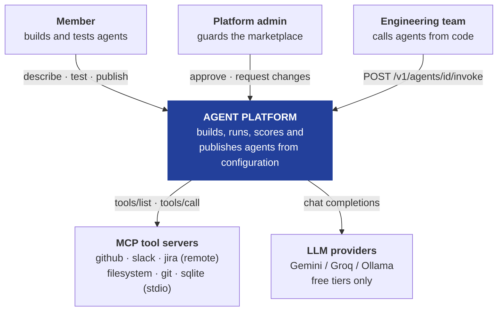

**Boundary rules**
- Credentials cross **inward only**. Nothing decrypted ever crosses back out.
- Agent designs cross **between tenants only** through the marketplace, only after admin approval.
- No paid service is on any path.

---

## 2. Container view

The deployable units. This is `architecture.drawio` page 1.

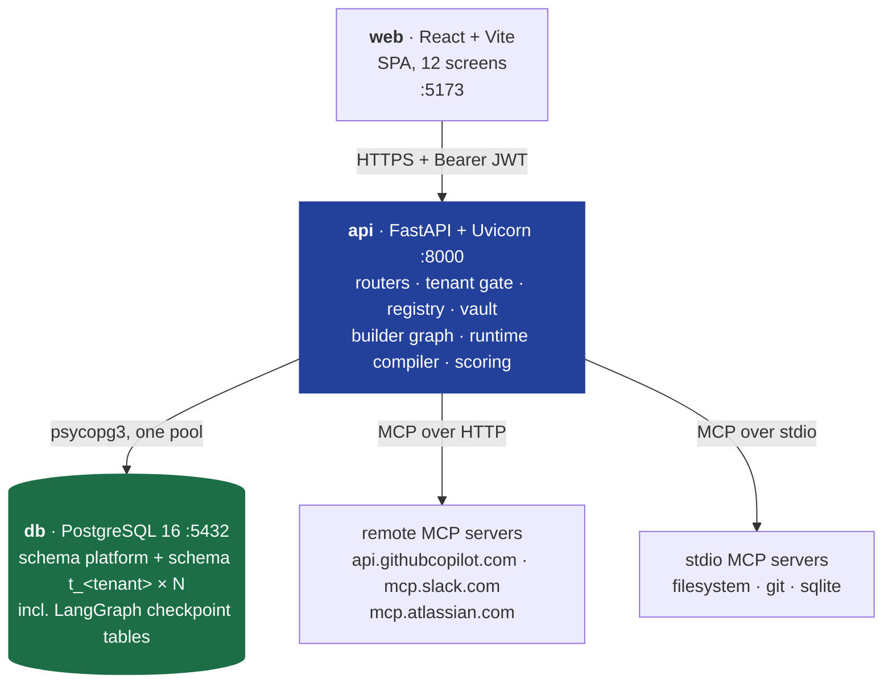

All five containers come up with a single `docker compose up`. That is a submission requirement.

---

## 3. Component view — inside `api`

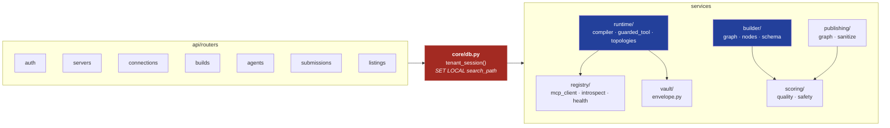

**Dependency rule:** routers never touch a service without passing through `tenant_session()`.
Enforced by every service function taking `session: AsyncSession` as its first parameter — there is
no way to get a session except from the gate.

---

## 4. Cross-cutting: tenancy

`architecture.drawio` page 2.

| Concern | Decision |
|---|---|
| Model | One database, one **schema per tenant** (`t_<uuid-hex>`) + one shared `platform` schema |
| Selection | `SET LOCAL search_path = t_x, platform` inside a per-request transaction |
| Enforcement | Unqualified table names. **No `WHERE tenant_id` exists in the codebase to delete** |
| Checkpoints | Live inside each tenant schema — closes the `thread_id`-only hole RLS would leave |
| Shared data | `platform.listings` (marketplace) and `platform.submission_index` (admin routing) |
| Not-found | Zero rows → `404`, never `403`, with a byte-identical body for unknown/malformed/cross-tenant |

---

## 5. Tech stack — what, and why this one

Every row answers: *what problem does this solve, and what breaks if we swap it?*

| Layer | Choice | Why exactly this | What breaks without it |
|---|---|---|---|
| **API framework** | **FastAPI** | LangGraph and the MCP SDK are both `async`; FastAPI is async-native. Pydantic is built in, so the agent config schema **validates itself**. OpenAPI comes free, which we reuse to generate the Postman collection. | Flask/Django sync workers block on every LLM call; you hand-write config validation and the Postman shape. |
| **Database** | **PostgreSQL 16** | The only engine that gives us all three things at once: **schemas** (our tenancy), **JSONB** (the config document), and an **official LangGraph checkpointer**. | SQLite has no schemas, no concurrent writers, and its checkpointer is dev-only → checks 1, 5, 6 all fail. |
| **DB driver** | **psycopg 3** | One driver serves **both** SQLAlchemy async **and** `langgraph-checkpoint-postgres`. It also accepts `options='-c search_path=…'` at connect time, which is how per-tenant checkpointers work. | asyncpg forces a second driver and a second pool → two places `search_path` can be wrong. |
| **ORM** | **SQLAlchemy 2 (async)** | Session scoping gives us exactly one place to run `SET LOCAL`. Unqualified `select(Agent)` is the whole isolation story. | Raw SQL means more strings that could accidentally name a schema. |
| **Migrations** | **Alembic**, two trees | `platform` and the per-tenant template evolve separately; `migrate_all.py` loops every schema. | By day 9 a schema change becomes manual work across N tenants. |
| **Agent runtime** | **LangGraph** | `interrupt()` + a durable checkpointer **is** graded checks 5 and 6. Nothing else gives durable pause-and-resume for free. | Writing your own resume machinery is ~3 days you do not have. |
| **Checkpointer** | **`AsyncPostgresSaver`** | Writes graph state to Postgres, so a pause survives a restart and a weekend. One per tenant schema. | `InMemorySaver` fails checks 5 and 6 the moment the container restarts. |
| **Model layer** | **`langchain.init_chat_model`** | One call swaps provider, so `model.provider` in the config is honoured and we keep a **fallback key for the live demo**. | Calling a provider SDK directly means a rewrite to switch when a free tier rate-limits mid-presentation. |
| **Tools** | **MCP Python SDK** | Rule 1 of the flow: the platform must **ask a server what tools it has**. `tools/list` + `tools/call` is exactly that. | Hardcoding tool names fails step 1 outright — "the registry would be a lie the moment a server changed". |
| **Crypto** | **`cryptography`, AES-256-GCM** | AEAD with **AAD** = `tenant_id‖server_id`, so a ciphertext row copied to another schema will not decrypt. | Fernet has no AAD, so a stolen row decrypts anywhere. |
| **Auth** | **PyJWT + argon2-cffi** | `tenant_id` and `role` travel in the token, which is what the gate reads. Stateless → no extra DB round trip per request. | Server sessions add a lookup before you can even pick a schema. |
| **Frontend** | **React + Vite** | The playground needs **SSE streaming** and optimistic approval UI; the mockups are already component-shaped (one card reused in 3 places). | Server-rendered templates make the build chat and the streaming playground awkward. |
| **Packaging** | **Docker Compose** | Grading runs `docker compose up`. Not optional. | — |

**Deliberately excluded:** LangGraph Platform (not free — the brief warns explicitly), Redis (nothing
needs it yet), Celery (the health re-check is a single asyncio task), any cloud KMS (env var + key
version is enough at this scale).

---

## 6. Non-functional requirements → the nine checks

| # | Check | Design element | Where |
|---|---|---|---|
| 1 | Isolation with filter removed | schema-per-tenant | §4, LLD §8.2 |
| 2 | Credential appears nowhere | envelope encryption, server name only in state | LLD §9 |
| 3 | Unguarded write cannot publish | approval recomputed from risk | LLD §11.1 |
| 4 | Planted material stripped | allowlist projection | LLD §11.2 |
| 5 | Kill mid-build, resume | `interrupt()` + `AsyncPostgresSaver` | LLD §7.3 |
| 6 | Approval overnight resumes | publish graph parked | LLD §7.5 |
| 7 | Multi-agent demo runs | supervisor topology | LLD §7.4 |
| 8 | Postman collection works | server-generated, token pre-filled | LLD §12 |
| 9 | Cross-tenant id → 404 | zero rows, no ownership branch | LLD §8.3 |

---

# PART II — LOW LEVEL DESIGN (LLD)

## 7. Behaviour — UML sequence diagrams

These are the six steps of the brief, technically.

### 7.1 Register an MCP server (step 1)

```mermaid
sequenceDiagram
    autonumber
    actor U as Priya
    participant API as routers/servers.py
    participant R as registry.introspect
    participant M as MCP server
    participant DB as Postgres

    U->>API: POST /v1/servers {name, transport, endpoint, auth}
    API->>R: register(spec)
    R->>M: initialize
    M-->>R: capabilities
    R->>M: tools/list
    M-->>R: [{name, description, inputSchema}, ...]
    R->>R: classify_risk(name, description)
    alt server answered
        R->>DB: INSERT mcp_servers; INSERT mcp_tools xN
        API-->>U: 201 {server, tools[], risks[]}
    else no answer / timeout
        API-->>U: 422 "could not connect - nothing was saved"
    end
```

**`classify_risk` is deterministic, not a model call.** First match wins:

```python
DESTRUCTIVE = ("delete", "drop", "remove", "destroy", "truncate", "purge", "revoke", "execute")
WRITE       = ("create", "post", "send", "update", "write", "set", "put", "patch",
               "close", "merge", "transition", "upload", "insert")
# everything else -> read
```

Admins can override a marking; the override is stored and audited. A tool that gained a risky verb
on a re-check flips back to the stricter marking automatically.

---

### 7.2 Add a connection (step 2)

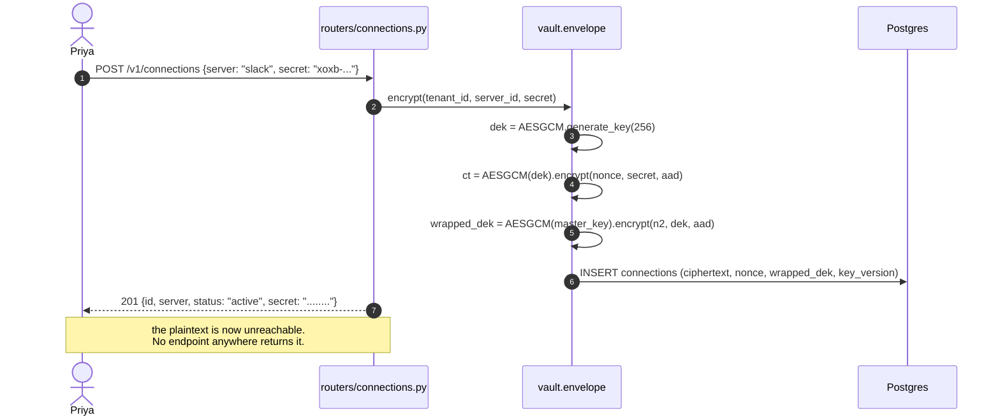

---

### 7.3 Build an agent — **the two graded pauses** (step 3)

This is the most important diagram in the project.

```mermaid
sequenceDiagram
    autonumber
    actor U as Priya
    participant API as routers/builds.py
    participant B as builder.graph
    participant CP as AsyncPostgresSaver
    participant DB as Postgres

    U->>API: POST /v1/builds {prompt}
    API->>B: astream(input, thread_id = T1)
    B->>B: understand -> search_registry
    B->>CP: checkpoint(T1, state)
    B-->>API: interrupt: select_tools {candidates}
    API-->>U: 202 {thread_id, interrupt, candidates}

    Note over B,CP: NOTHING IS RUNNING.<br/>The build is one row in checkpoints.<br/>Kill the container here - check 5.

    U->>API: POST /v1/builds/T1/resume {selected}
    API->>B: astream(Command(resume), thread_id = T1)
    B->>DB: SELECT FROM connections WHERE server_name IN (...)
    Note right of B: github ok, slack missing
    B->>CP: checkpoint(T1, state)
    B-->>API: interrupt: missing_connection {slack}
    API-->>U: 202 {interrupt, missing}

    U->>API: POST /v1/connections {slack, secret}
    U->>API: POST /v1/builds/T1/resume {connected}
    API->>B: astream(Command(resume), thread_id = T1)
    B->>B: assemble_config, forcing approval=ask on writes
    B->>B: score, one row per check
    B->>DB: INSERT agents; INSERT agent_checks
    API-->>U: 200 {agent card}
```

**Why the pause survives a restart:** after every node, `AsyncPostgresSaver` writes the full graph
state into `t_northwind.checkpoints` keyed by `T1`. Resuming is
`astream(Command(resume=value), config={"configurable": {"thread_id": "T1"}})` — the library replays
to the interrupt and returns `value` from the `interrupt()` call. No process was alive in between.

**Form mode reuses this exact graph** — it starts the same thread with both answers pre-seeded, so
both interrupts resolve immediately. *"Do not write the builder twice."*

---

### 7.4 Run in the playground with an approval (step 4)

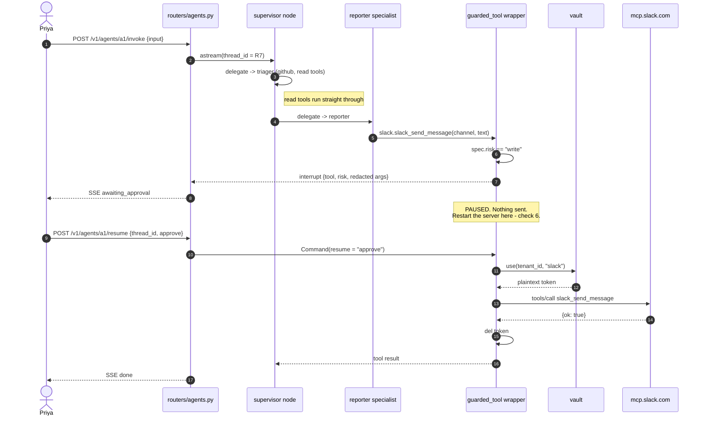

**The control:**

```python
def guarded_tool(spec: ToolSpec, ctx: RunContext):
    async def _run(**kwargs):
        if spec.risk in ("write", "destructive"):          # <- from the REGISTRY, not the config
            decision = interrupt({"type": "tool_approval", "tool": spec.ref,
                                  "risk": spec.risk, "args": redact(kwargs)})
            if decision != "approve":
                return f"Rejected by the user. {spec.ref} was not executed."
        token = vault.use(ctx.tenant_id, spec.requires_connection)
        try:
            return await mcp_call(spec, kwargs, token)
        finally:
            del token
    return _run
```

The model cannot route around this — it does not call the tool, it calls the wrapper.

---

### 7.5 Publish → admin review (step 5)

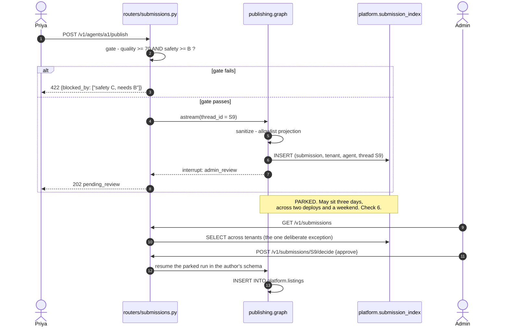

---

### 7.6 Install from the marketplace (step 6)

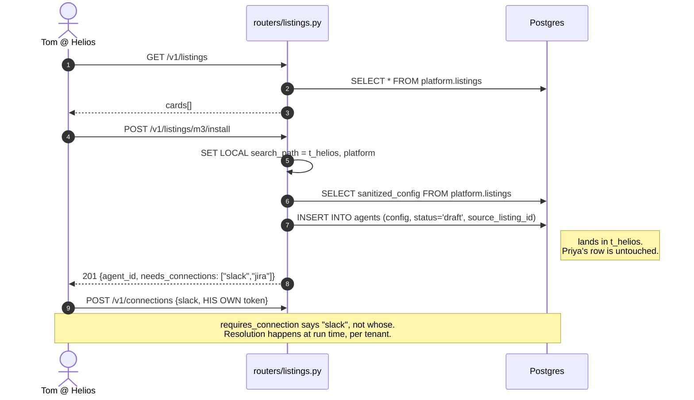

---

## 8. Data model

### 8.1 ER — `platform` schema (shared)

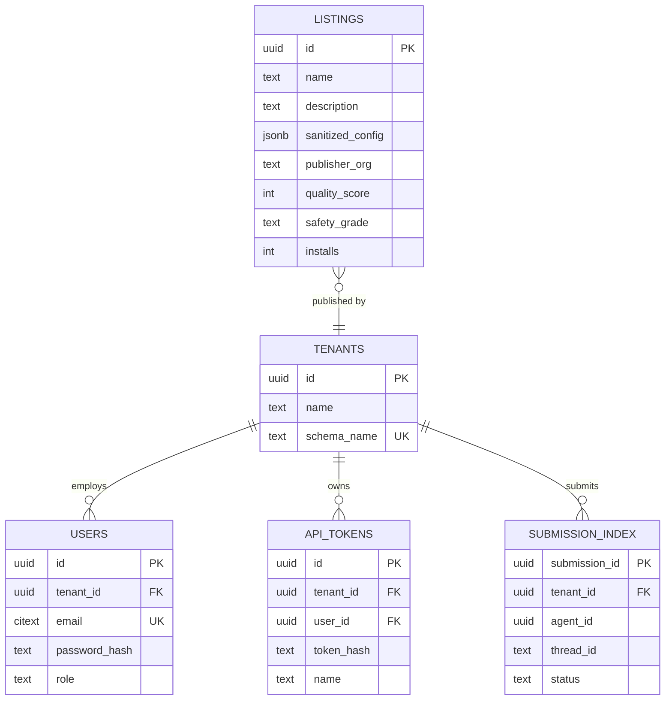

### 8.2 ER — `t_<tenant>` schema (one per company)

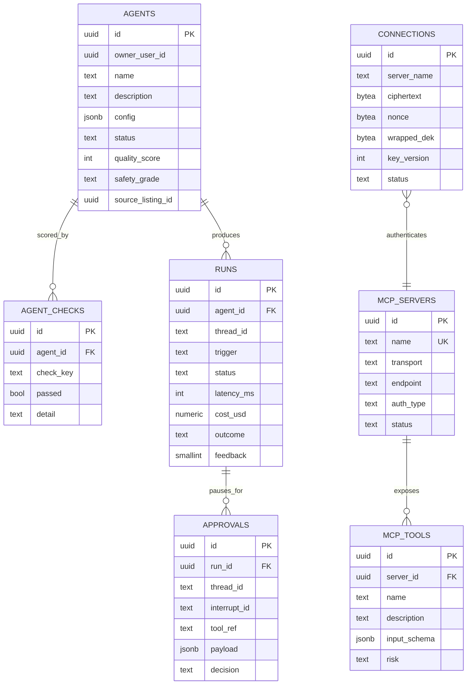

Plus, in every tenant schema, LangGraph's own `checkpoints`, `checkpoint_blobs`,
`checkpoint_writes`, created by `await checkpointer.setup()`.

### 8.3 The 404 rule

```python
async def get_agent(agent_id: UUID, s: AsyncSession = Depends(tenant_session)):
    agent = await s.scalar(select(Agent).where(Agent.id == agent_id))   # no tenant clause
    if agent is None:
        raise HTTPException(404, detail={"error": "not_found"})          # identical body, always
    return agent
```

There is no `else: raise 403` branch anywhere in the codebase. That is the whole of check 9.

---

## 9. Class model — the config and the runtime

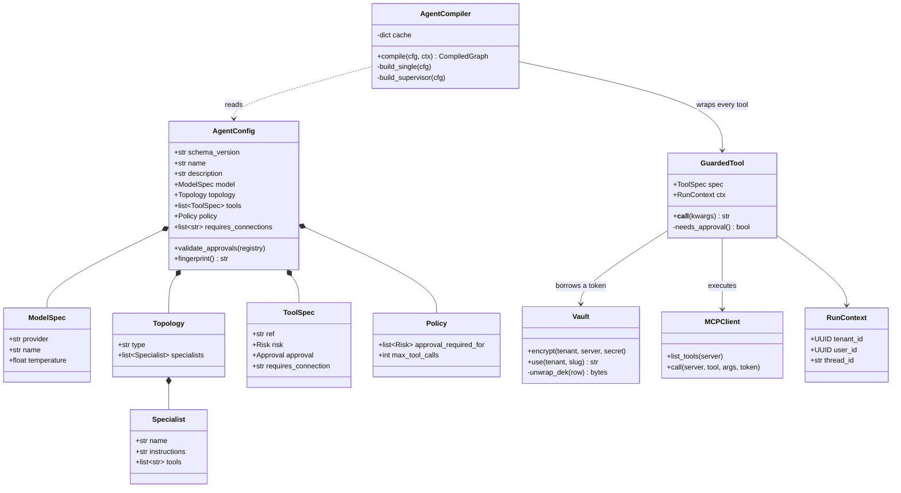

**Note what is missing:** no class holds a token as a field. `Vault.use()` returns one into a local
variable inside `GuardedTool.__call__` and it dies there. That is check 2, expressed as a class
diagram.

---

## 10. State machines

### 10.1 Agent lifecycle

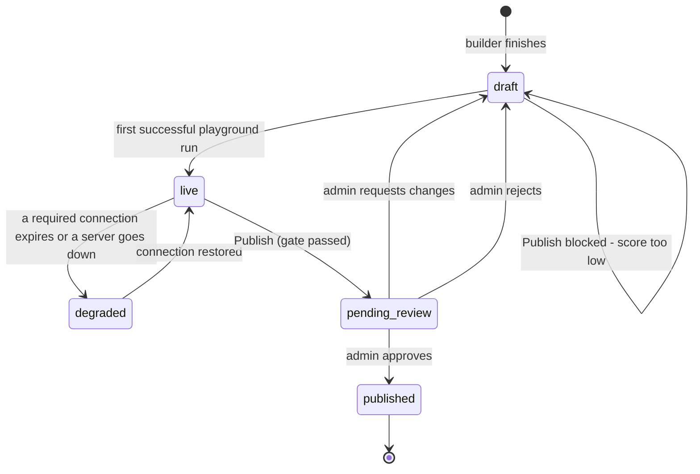

`degraded` is computed, never a stored flag: it still answers, still uses its working tools, and
reports the broken one. It must not crash.

### 10.2 A single run

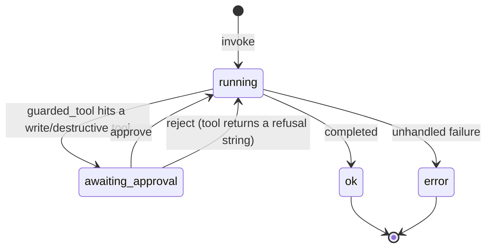

While in `awaiting_approval` no process is alive. The state is a row in `t_<tenant>.checkpoints`,
which is why it survives restarts and weekends.

---

## 11. Key algorithms

### 11.1 Approval derivation (check 3)

Runs on save **and** at compile time. The config's own `approval` field is advisory only.

```python
def enforce_approvals(cfg: AgentConfig, registry: dict[str, Risk]) -> list[str]:
    violations = []
    for t in cfg.tools:
        true_risk = registry[t.ref]              # authoritative, from mcp_tools
        t.risk = true_risk
        if true_risk in (Risk.WRITE, Risk.DESTRUCTIVE):
            if t.approval != Approval.ASK:
                violations.append(f"{t.ref} is {true_risk} but set to run without approval")
            t.approval = Approval.ASK            # corrected regardless
    return violations
```

### 11.2 Sanitize — allowlist projection (check 4)

```python
LISTING_FIELDS = ("name", "description", "topology", "tools",
                  "requires_connections", "policy", "model")
TOOL_FIELDS    = ("ref", "risk", "approval", "requires_connection")

def project(cfg: dict) -> dict:
    out = {k: cfg[k] for k in LISTING_FIELDS if k in cfg}
    out["tools"] = [{k: t[k] for k in TOOL_FIELDS if k in t} for t in cfg["tools"]]
    return out          # anything not named above cannot travel. by construction.
```

Then a scrubber over the free-text fields only (`description`, all `instructions`): internal
hostnames, emails, >=32-char high-entropy strings. If it fires, **block and show the author a diff**
rather than silently mangling their text.

> **Why allowlist, not denylist:** a denylist loses the moment the grader plants something you did
> not think of. A projection cannot lose that way — an unnamed field is simply never read.

### 11.3 Scoring (rule 6)

Both numbers are pure functions of `runs` + `agent_checks`. No model call, ever.

```
quality = 20·(runs >= 5) + 30·success_rate(last 20) + 20·thumbs_up_ratio
        + 15·(all granted tools used) + 10·(median latency < 15s) + 5·(no error in last 5)

safety  = count of 5 booleans -> 5:A  4:B  3:C  else D
          1. every write/destructive tool has approval = ask
          2. all referenced servers healthy and tool lists present
          3. no credential-shaped string in config or stored traces
          4. no granted-but-never-used tools
          5. tested at least 5 times

publishable = quality >= 70 and safety in ("A", "B")
```

Every term writes an `agent_checks` row with `detail`, so the UI answers *"why is it a B?"*.

---

## 12. API contract

| Method | Path | Auth | Notes |
|---|---|---|---|
| POST | `/auth/register` | — | creates tenant + `CREATE SCHEMA` + tenant migrations |
| POST | `/auth/login` | — | → JWT `{user_id, tenant_id, role}` |
| GET/POST | `/v1/servers` | JWT | POST introspects before saving; 422 if unreachable |
| POST | `/v1/servers/{id}/refresh` | JWT | re-runs `tools/list`, updates health |
| GET/POST/DELETE | `/v1/connections` | JWT | POST encrypts; **no GET ever returns a secret** |
| POST | `/v1/builds` | JWT | → `202 {thread_id, interrupt, payload}` |
| POST | `/v1/builds/{thread_id}/resume` | JWT | `Command(resume=…)`; → 202 again, or 200 + agent |
| GET | `/v1/agents` | JWT | this schema only |
| GET | `/v1/agents/{id}` | JWT | **404** if not in this schema |
| GET | `/v1/agents/{id}/graph` | JWT | nodes/edges derived from `config` |
| POST | `/v1/agents/{id}/invoke` | JWT **or** API token | |
| POST | `/v1/agents/{id}/stream` | JWT or token | SSE: `token`, `tool_call`, `awaiting_approval`, `done` |
| POST | `/v1/agents/{id}/resume` | JWT or token | `{thread_id, decision}` |
| GET | `/v1/agents/{id}/postman` | JWT | v2.1 collection, caller's token pre-filled |
| POST | `/v1/agents/{id}/publish` | JWT | 422 with `blocked_by[]` if the gate fails |
| GET | `/v1/submissions` | JWT **admin** | reads `platform.submission_index` |
| POST | `/v1/submissions/{id}/decide` | JWT **admin** | resumes the parked graph |
| GET | `/v1/listings` | JWT | `platform.listings` |
| POST | `/v1/listings/{id}/install` | JWT | copies the config into the caller's schema |

**Error shape, everywhere:** `{"error": "<code>", "detail": "<human sentence>"}`.
`not_found` is byte-identical for unknown, malformed and cross-tenant ids.

---

## 13. Module layout

```
app/
  core/
    config.py          pydantic-settings; FORGE_MASTER_KEY, DATABASE_URL, provider keys
    security.py        argon2 hashing, JWT encode/decode
    db.py              engine, SessionLocal, tenant_session()  <- the gate
  tenancy/
    schema_names.py    tenant_id -> "t_<hex>"  (one function, used everywhere)
    provision.py       create_tenant(): CREATE SCHEMA + run tenant migrations
    checkpointers.py   cache: tenant_id -> AsyncPostgresSaver
  models/
    platform_.py       Tenant, User, ApiToken, Listing, SubmissionIndex
    tenant.py          Agent, AgentCheck, Run, Approval, Submission, Connection,
                       McpServer, McpTool          (no schema= kwarg, ever)
  registry/
    mcp_client.py      list_tools(), call()
    introspect.py      register(), classify_risk()
    health.py          periodic re-check task
  vault/
    envelope.py        encrypt(), use()            <- only plaintext in the codebase
  builder/
    schema.py          AgentConfig + friends (pydantic)  <- DAY 1 ARTIFACT
    nodes.py           understand, search_registry, check_connections, assemble, score, persist
    graph.py           wiring + the two interrupt() calls
  runtime/
    compiler.py        compile_agent()
    guarded_tool.py    the approval gate
    topologies.py      single / supervisor builders
    models.py          init_chat_model wrapper, provider fallback
  scoring/
    quality.py  safety.py
  publishing/
    sanitize.py        project() + scrub()
    graph.py           sanitize -> interrupt(admin_review) -> list
  api/routers/         auth · servers · connections · builds · agents · submissions · listings
```

---

## 14. Start here — the first four things

Do these **before any screen exists**. Each is verifiable from a terminal.

### Step 1 — it boots

`docker-compose.yml` with two services — `db` (postgres:16) and `api`. Get
`docker compose up` → `GET /health` → `{"ok": true}` working, and nothing else.

### Step 2 — two schemas that cannot see each other

Create `t_alpha` and `t_beta`, put an `agents` table in each, insert one row in each. Then write
**this test before the code that passes it**:

```python
async def test_isolation_holds_without_any_filter():
    async with tenant_session(alpha) as s:
        rows = (await s.scalars(select(Agent))).all()   # deliberately no WHERE
        assert len(rows) == 1
        assert rows[0].name == "alpha-agent"            # beta's row is unreachable
```

**Do not move on until this passes.** It is graded check 1, and everything else is built on it.

### Step 3 — one agent configuration, typed by hand

Create `app/builder/schema.py` with the Pydantic model, and `fixtures/issue_digest.json` written
**by hand, by the four of you together**. Do not generate it. This conversation is the most valuable
hour of the fortnight — it forces you to decide what an agent *is*.

### Step 4 — the runtime

```python
# scripts/run_agent.py
cfg = AgentConfig.model_validate_json(Path("fixtures/issue_digest.json").read_text())
graph = compile_agent(cfg, ctx)
async for ev in graph.astream({"messages": [("user", "list my open issues")]}, config):
    print(ev)
```

Run it from the terminal. Watch it call a real MCP tool. **Still no UI.**

When those four work you are roughly 40% done, because everything after is screens over machinery
that already runs. Build the UI first and you will spend week two discovering the machinery does not
fit behind it.

---

## 15. Risks

| Risk | Mitigation | When |
|---|---|---|
| Migrations across N schemas become manual | two Alembic trees + `migrate_all.py` | **Day 2**, not day 9 |
| A query schema-qualifies a tenant table | CI grep failing the build on `t_` in SQL / `schema=` | Day 2 |
| `SET LOCAL` outside a transaction leaks | one dependency owns it; never a bare pool checkout | Day 2 |
| Per-tenant checkpointer pooling fights back | spike it before anyone builds on it | **Day 3** |
| `interrupt()` inside a tool call misbehaves | spike it; fall back to a hand-written tool node | **Day 3** |
| Free-tier rate limit during the live demo | multi-provider from day 1, second key configured | Day 1 |
| LangGraph Platform assumed to be free | it is not — self-host from day one | Day 1 |
